- [javaSE](../Java设计模式/java设计模式.md)
- [Java数据结构及算法](../Java数据结构及算法/Java数据结构及算法.md)
- [JavaWeb2022版](../JavaWeb2022版/JavaWeb2022.md)
- [JavaWeb经典版](../JavaWeb经典版/JavaWeb经典.md)
- [JDBC](../JDBC/JDBC.md)
- [JVM](../JVM/JVM.md)
- [Springmvc](../SpringMVC/SpringMVC.md)
- [SpringBoot1](../SpringBoot1/SpringBoot1.md)
- [SpringBoot2](../Springboot2/Springboot2.md)
---
---
- [JavaSE](#javase)
    - [字节](#字节)
- [java语言开发环境搭建](#java语言开发环境搭建)
    - [java虚拟机--jvm](#java虚拟机--jvm)
    - [JRE和JDK](#jre和jdk)
    - [jdk下载安装](#jdk下载安装)
    - [环境变量的配置](#环境变量的配置)
- [Hello World](#hello-world)
    - [程序开发步骤说明](#程序开发步骤说明)
    - [编写java源程序](#编写java源程序)
    - [标识符](#标识符)
- [常量](#常量)
    - [概述](#概述)
    - [分类](#分类)
- [变量和数据类型](#变量和数据类型)
    - [数据类型分类](#数据类型分类)
    - [基本数据类型](#基本数据类型)
    - [变量](#变量)
    - [数据类型转换](#数据类型转换)
- [运算符](#运算符)
    - [算数运算符](#算数运算符)
    - [自增自减运算符](#自增自减运算符)
    - [赋值运算符](#赋值运算符)
    - [比较运算符](#比较运算符)
    - [逻辑运算符](#逻辑运算符)
    - [三元运算符](#三元运算符)
- [方法入门](#方法入门)
    - [方法的定义](#方法的定义)
- [各种语句](#各种语句)
    - [if 语句](#if-语句)
    - [swithch语句](#swithch语句)
    - [循环语句](#循环语句)
    - [使用scanner类](#使用scanner类)
- [数组](#数组)
    - [数组的概述](#数组的概述)
    - [内存](#内存)
    - [二维数组](#二维数组)
    - [数组的内存解析:见ArrayTest3.java](#数组的内存解析见arraytest3java)
    - [数组元素的排序算法](#数组元素的排序算法)
    - [十大内部排序算法](#十大内部排序算法)
    - [数组中常见的算法](#数组中常见的算法)
    - [Arrays 工具类的使用](#arrays-工具类的使用)
    - [数组使用中的常见异常](#数组使用中的常见异常)
- [面向对象(上)](#面向对象上)
    - [面向过程(POP)与面向对象(OOP)](#面向过程pop与面向对象oop)
    - [类和对象](#类和对象)
    - [Java 类及类的成员](#java-类及类的成员)
    - [类与对象的创建及使用](#类与对象的创建及使用)
    - [对象的创建和使用：内存解析](#对象的创建和使用内存解析)
    - [类的成员之一：属性](#类的成员之一属性)
    - [类的成员之二：方法](#类的成员之二方法)
        - [类中方法的声明和使用](#类中方法的声明和使用)
        - [理解”万事万物皆对象“](#理解万事万物皆对象)
        - [对象数组的内存解析](#对象数组的内存解析)
        - [可变个数的形参](#可变个数的形参)
        - [方法参数的值传递机制(重点！！！)](#方法参数的值传递机制重点)
        - [递归(recursion)方法](#递归recursion方法)
    - [面向对象特征之一：封装与隐藏](#面向对象特征之一封装与隐藏)
        - [四种权限修饰符的理解与测试](#四种权限修饰符的理解与测试)
    - [类的成员三：构造器(构造方法)](#类的成员三构造器构造方法)
        - [构造器的理解](#构造器的理解)
        - [总结属性赋值的过程](#总结属性赋值的过程)
        - [JavaBean 的使用](#javabean-的使用)
      - [UML类图](#uml类图)
    - [关键字this的使用](#关键字this的使用)
        - [this 调用属性、方法、构造器](#this-调用属性方法构造器)
    - [关键字：package、import 的使用](#关键字packageimport-的使用)
        - [关键字—package](#关键字package)
        - [MVC 设计模式](#mvc-设计模式)
        - [关键字-import](#关键字-import)
- [面向对象(中)](#面向对象中)
    - [继承性的使用与理解](#继承性的使用与理解)
    - [方法的重写(override/overwrite)](#方法的重写overrideoverwrite)
    - [super关键字的使用](#super关键字的使用)
    - [子类对象的实例化过程](#子类对象的实例化过程)
    - [多态性](#多态性)
        - [虚拟方法的补充](#虚拟方法的补充)
      - [向下转型的使用](#向下转型的使用)
      - [instanceof 关键字都使用](#instanceof-关键字都使用)
    - [Object类都的使用](#object类都的使用)
        - [object类的主要对象](#object类的主要对象)
    - [包装类（Wrapper）的使用](#包装类wrapper的使用)
        - [单元测试方法的使用](#单元测试方法的使用)
        - [包装类与基本数据类型相互转换](#包装类与基本数据类型相互转换)
- [面向对象（下）](#面向对象下)
    - [关键字static](#关键字static)
        - [单例设计模式](#单例设计模式)
    - [理解main方法的语法（了解）](#理解main方法的语法了解)
    - [类的成员之四：代码块](#类的成员之四代码块)
    - [关键字：final](#关键字final)
    - [抽象类与抽象方法](#抽象类与抽象方法)
        - [abstract 关键字的使用](#abstract-关键字的使用)
        - [抽象类应用](#抽象类应用)
        - [创建抽象类的匿名子类对象](#创建抽象类的匿名子类对象)
    - [接口](#接口)
        - [概述](#概述-1)
        - [接口的应用:代理模式(proxy)](#接口的应用代理模式proxy)
        - [接口的应用：工厂模式](#接口的应用工厂模式)
    - [Java8中关于将接口的改进](#java8中关于将接口的改进)
    - [类的内部成员之五：内部类](#类的内部成员之五内部类)
        - [匿名内部类](#匿名内部类)
        - [局部内部类的使用注意](#局部内部类的使用注意)
- [异常](#异常)
    - [异常处理机制一：try-catch-findally](#异常处理机制一try-catch-findally)
    - [异常处理机制二：throws](#异常处理机制二throws)
    - [手动抛出异常](#手动抛出异常)
    - [用户自定义异常类](#用户自定义异常类)
- [多线程](#多线程)
    - [基本概念：程序、进程、线程](#基本概念程序进程线程)
        - [进程与线程](#进程与线程)
        - [多线程的优点](#多线程的优点)
        - [何时需要多线程](#何时需要多线程)
    - [线程的创建和使用](#线程的创建和使用)
        - [线程的创建和启动](#线程的创建和启动)
    - [线程的生命周期](#线程的生命周期)
    - [同步代码块处理实现Runnable的线程安全问题](#同步代码块处理实现runnable的线程安全问题)
    - [同步代码块处理继承Thread类的线程安全问题](#同步代码块处理继承thread类的线程安全问题)
    - [同步方法处理实现Runnable的线程安全问题](#同步方法处理实现runnable的线程安全问题)
- [常用类](#常用类)
    - [String类的概述](#string类的概述)
    - [String不同实例化方式的对比1](#string不同实例化方式的对比1)
    - [String不同拼接操作的对比](#string不同拼接操作的对比)
- [枚举类和注解的使用](#枚举类和注解的使用)
    - [枚举类的理解](#枚举类的理解)
    - [自定义枚举类](#自定义枚举类)
    - [使用enum关键字定义枚举类](#使用enum关键字定义枚举类)
    - [eunum类中的常用方法](#eunum类中的常用方法)
    - [使用enum关键字定义的枚举类实现接口](#使用enum关键字定义的枚举类实现接口)
    - [注解的理解](#注解的理解)
    - [Annotaton的使用示例](#annotaton的使用示例)
    - [如何自定义注解](#如何自定义注解)
    - [jdK中4个基本的元注解的使用1](#jdk中4个基本的元注解的使用1)
    - [jdk中4个基本的元注解的使用2](#jdk中4个基本的元注解的使用2)
- [集合](#集合)
    - [集合框架与数组的对比及概述](#集合框架与数组的对比及概述)
    - [集合框架涉及到的API](#集合框架涉及到的api)
    - [Collection 接口方法](#collection-接口方法)
        - [Collection接口中的常用方法1](#collection接口中的常用方法1)
        - [Collection接口中的常用方法2](#collection接口中的常用方法2)
        - [Collection接口中的常用方法3](#collection接口中的常用方法3)
        - [Collection接口中的常用方法4](#collection接口中的常用方法4)
    - [Iterator迭代器接口](#iterator迭代器接口)
        - [使用Iterator遍历Collection](#使用iterator遍历collection)
        - [Iterator迭代器remove()的使用](#iterator迭代器remove的使用)
        - [java新特性foreach循环遍历集合或数组](#java新特性foreach循环遍历集合或数组)
    - [Collection子接口之一：List接口](#collection子接口之一list接口)
        - [List接口常用实现类的对比](#list接口常用实现类的对比)
        - [ArrayList的源码分析](#arraylist的源码分析)
        - [LikedList源码分析](#likedlist源码分析)
        - [List接口中的常用方法测试](#list接口中的常用方法测试)
    - [Collection子接口之二：Set接口](#collection子接口之二set接口)
        - [Set接口实现类的对比](#set接口实现类的对比)
        - [Set的无序性与不可重复性的理解](#set的无序性与不可重复性的理解)
        - [HashSet中元素的添加过程](#hashset中元素的添加过程)
- [泛型](#泛型)
        - [为什么要有泛型](#为什么要有泛型)
        - [泛型的设计背景](#泛型的设计背景)
- [File类的使用](#file类的使用)

# JavaSE


### 字节

 ==字节==是常见的计算机最小存储单元。计算机存储任何的数据，都是以字节的形式存储。

 ==8个bit(二进制位)0000-0000表示1个字节，记1byte或1B==
* 8 bit = 1 Byte

* 1024 B = 1 KB
  
* 1024 kb =1 MB

* 1024 MB =1 GB

* 1024 GB =1 TB

---


# java语言开发环境搭建    

### java虚拟机--jvm
java的虚拟机本身不具备跨平台功能的，每个操作系统都有不同版本的虚拟机，如下图所示：
* 语言解释器
* 跨平台
  
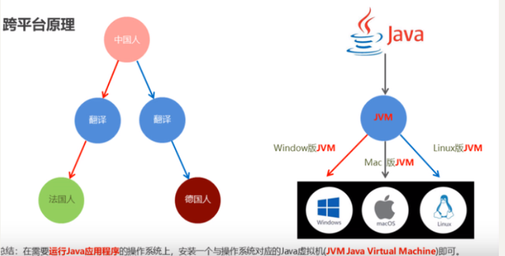

### JRE和JDK
* JRE:java程序的运行环境，包含jvm和运行所需的核心类库
* JDK:java程序开发包，包含JRE和开发人员工具
  
如果想运行一个已有的java程序，只需安装JRE即可,如果想要开发一个全新的java程序，就必须安装JDK。

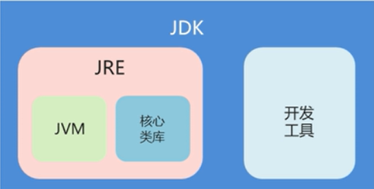

### jdk下载安装

### 环境变量的配置

---

# Hello World 

### 程序开发步骤说明
java程序开发三步骤：
  * 编写
  * 编译
  * 运行
  


### 编写java源程序
  * 步骤
    1. 新建文本txt，后缀名为.java
    2. 用记事本打开
    3. 在文本中输入代码
    ```java{.line-numbers}
    public class Helloworld {
    public static void main(String[ ] args){
    System.out.println("Hello world!");
        }
     }
    ```

  * 编译和运行文件
    1. 编译：cmd-javac '文件.java'---->'文件.class'
    2. 运行：java '文件'---->打印helloworld

### 标识符
* 命名规则：
  * 标识符可以包含|英文字母26个(区分大小写)、0-9数字、$(美元符号）和_f下划线)
  * 标识符不能以数字开头。
  * 标识符不能是关键字
* 命名规范：
  * 类名规范:首字母大写，后面每个单词首字母大写(大驼峰式)。
  * 变量名规范:首字母小写，后面每个单词首字母大写(小驼峰式)。
  * 方法名规范:同变量名。

---

# 常量
### 概述
* 常量：指程序运行期间不变的量

### 分类
* 常量的分类:
  * 1．字符串常量:凡是用双引号引起来的部分，叫做字符串常量。例如: "abc"、"Hello"、"123
  * 2．整数常量:直接写上的数字，没有小数点。例如:100、200、0、-250
  * 3．浮点数常量:直接写上的数字，有小数点。例如:2.5、-3.14、0.0
  * 4．字符常量:凡是用单引号引起来的单个字符，就做字符常量。例如: 'A'、'b'、'9'、'中'
  * 5.布尔常量:只有量中取值。true、 false.
  * 6．空常量: null。代表没有任何数据
  
---


# 变量和数据类型
### 数据类型分类
* 基本数据类型：
  * 整数 byte short int long
  * 浮点型 float double
  * 字符 char
  * 布尔 boolean
* 引用数据类型
  * 类
  * 数组
  * 接口
  * 字符串
### 基本数据类型

  ==注：浮点数默认类型是double,如果要使用float类型，需加上一个后缀F。整数默认为int，如果要使用lone类型，需加上一个后缀L==
### 变量
* 概述
  * 程序运行期间可以改变的量
* 使用变量的注意事项
  * 1．如果创建多个变量，那么变量之间的名称不可以重复。
  * 2．对于float和long类型来说，字母后缀F和L不要丢掉。
  * 3．如果使用byte或者short类型的变量，那么右侧的数据值不能超过左侧类型的范围。
  * 4．没有进行赋值的变量，不能直接使用;一定要赋值之后，才能使用。
  * 5．变量使用不能超过作用域的范围。
【作用域】:从定义变量的一行开始，一直到直接所属的大括号结束为止。
### 数据类型转换
* 显式转换
* 强制转换
* 数据类型转换注意事项
  1. 强制类型转换一般不推荐使用，因为有可能发生精度损失
  2. byte/short/char这三种类型都可以发生数学运算，如例1
  3. byte/short/char这三种类型在运算的时候，都会被首先提升成为int类型，然后再计算。如例2
  
    ```java{.line-numbers}
    //例1：       
   char shu = 'A';
   system.out.println(shu + 1); //  66，也就是大写字母A被当做65进行处理
    
    //例2：
    byte num1 = 40; //注意：右侧的数值大小不能超过左侧的类型范围
    byte num2 = 50;
    //  byte + byte --->  int + int --->int
    int byte result1 = num1 + num2;
    System.out.println(result1);  //90
    ```


---

# 运算符

### 算数运算符
*
  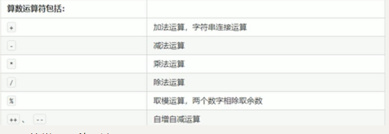

* "+"号的常用三种用法
  1. 对于数值来说，那就是加法。
  2. 对于字符char类型来说，在计算之前，char会被提升成为int，然后再计算。char类型字符，和int类型数字，之间的对照关系表: ASCII、Unicode
  3. 对于字符串string (首字母大写，并不是关键字）来说，加号代表字符串连接操作。
  ```java{.line-numbers}
  String str1 = 'hello';
  System.out.println(str1 + 'hello'); //  hellohello
  ```
### 自增自减运算符
  * 与C语中一样

### 赋值运算符
  * 与C语中一样

### 比较运算符
  * 与C语中一样

### 逻辑运算符
  * 与C语中一样

### 三元运算符
  * 与C语中一样


---

# 方法入门

### 方法的定义
* 定义一个方法的格式
  ```java{.line-numbers}
  public  static void 方法名称(){
    方法体
  }
  ```
* 方法的调用
  ```java{.line-numbers}
  /* 注意事项:
  1.方法定义的先后顺序无所谓。
  2．方法的定义不能产生嵌套包含关系。
  3．方法定义好了之后，不会执行的。如果要想执行，一定要进行方法的【调用】。
  */
  public  class Demo11Method{
    public static void main(String[] args){
      //调用
      farmer();
      seller();
      cook();
      me();
    }
    public static void cook() {
      system.out.println("洗菜");
      system.out.println("切菜");
      system.out.println("");
      system.out.println("");
    }
    public static void farmer() {

    }
    public static void seller() {

    }
    public static void me() {

    }
  }
  ```
  * 方法的三种调用
    1. 单独调用
    2. 打印调用
    3. 赋值调用
  ---

# 各种语句

### if 语句
  * 单IF语句
    ```java{.line-numbers}
    if(关系表达式)  {
      语句体1
    }
    ```
  * 标准IF语句

    ```java{.line-numbers}
    if(关系表达式)  {
      语句体1;
    }
    else {
      语句2;
    }
    ```
  * 扩展if..else if语句
    
    ```java{.line-numbers}
    if(关系表达式)  {
      语句体1;
    }
    else if {
      语句2;
    }
    else  {
      语句3;
    }
    ```
### swithch语句
  * 标准switch语句
    ```java{.line-numbers}
    switch(表达式)  {
      case 常量值1：
        语句体1;
        break;
      case 常量值2:
        语句体2;break;
      ....
      default:
        语句体n;break;
    }
    ```
  * 注意事项
    1. switch后面小括号当中只能是下列数据类型:基本数据类型:byte/short/char/int
    2. 引用数据类型: String字符串、enum枚举

### 循环语句
  * 三种循环语句
    1.  for
    2.  while
    3.  do-while

### 使用scanner类
  * Scanner 类的用法
    1.  首先需要构造一个Scanner类的对象，并且与标准输入流System.in关联
    Scanner sc=new Scanner(System.in);
    2. 调用Scanner类对象sc的方法从输入流中获取你需要的输入
    int i=sc.nextInt()；
      ```java{.line-numbers}
      /*如何从键盘获取不同类型的变量：需要使用Scanner类
      Scanner类是java.util包中的一个类
      具体实现步骤:
      1.导包:import java.util.Scanner;
      2.Scanner的实例化
      */
      import java.util.Scanner;
      public class ScannerTest {
          public static void main(String[] args) {
              Scanner scan = new Scanner(System.in); 
              int num = scan.nextInt();
              System.out.println(num);

              }

      }
      ```
---

# 数组

### 数组的概述
1. 多个相同类型数据按一定顺序排列的集合，并使用一个名字命名，通过编号进行统一的管理
2. 数组的相关概念：
   * 数组名
   * 元素
   * 角标、下标、索引
   * 数组的长度：元素的个数
3. 数组的特点：
    * 数组属于引用类型的变量。数组的元素，既可以是基本数据类型，也可以是引用数据类型
    * 创建数组对象会在内存中开辟一整块==连续==的空间
    * 数组的长度一旦确定，就不能修改
    * 数组是有序排列的
4. 数组的分类：
    * 按照维数：一维数组、二维数组、三维数组……
    *  按照数组元素类型：基本数据类型元素的数组、引用类型元素的数组

5. 一维数组的使用
    * 一维数组的声明和初始化
      * 代码案例1_ArrayTest.java
          ```java{.line-numbers,cmd=true}
            public class ArrayTest {
              public static void main(String[] args) {
                
                //1. 一维数组的声明和初始化
                int num;	//声明
                num = 10;	//初始化
                int id = 1001;	//声明 + 初始化
                
                int[] ids;	//声明
                //1.1静态初始化:数组的初始化和数组元素的赋值操作同时进行
                ids = new int[]{1001,1002,1003,1004};	
                //1.2动态初始化:数组的初始化和数组元素的赋值操作分开进行
                String[] names = new String[5]; 
                
                //错误的写法：
            //		int[] arr1 = new int[];	//未赋值、未指明长度
            //		int[5] arr2 = new int[5];
            //		int[] arr3 = new int[3]{1,2,3};
                
                //也是正确的写法：
                int[] arr7 = {1,2,3,5,4};//类型推断
                
                /*总结：数组一旦初始化完成，其长度就确定了。
                */
                
                //2.如何调用数组的指定位置的元素：通过角标的方式调用。
                //数组的角标(或索引)从0开始的，到数组的长度-1结束
                names[0] = "张郃";
                names[1] = "王陵";
                names[2] = "张学良";
                names[3] = "王传志";	//charAt(0)
                names[4] = "李峰";
            //		names[5] = "周礼";	//如果数组超过角标会通过编译，运行失败。
                
                //3.如何获取数组的长度
                //属性：length
                System.out.println(names.length);	//5
                System.out.println(ids.length);	//4
                
                //4.如何遍历数组
            //		System.out.println(names[0]);
            //		System.out.println(names[1]);
            //		System.out.println(names[2]);
            //		System.out.println(names[3]);
            //		System.out.println(names[4]);
                
                for(int i = 0;i < names.length;i++){
                  System.out.println(names[i]);
                }
                
              }
            }
            ```
    *  如何调用数组的指定位置的元素
    *  如何获取数组的长度
    *  如何遍历数组
    *  数组的内存解析：见ArrayTest1.java
    *  数组元素的默认初始化值：见ArrayTest1.java
       *  代码案例2：ArrayTest1.java
      ```java
      */  数组元素是整形：0
        	数组元素是浮点型：0.0
        	数组元素是char型：0或'\u0000'，而非'0'
        	数组元素是boolean型:false
        	数组元素是引用数据类型：null 
      */
      public class ArrayTest1 {
          public static void main(String[] args) {
            //5.数组元素的默认初始化值
            int[] arr = new int[4];
            for(int i = 0;i < arr.length;i++){
              System.out.println(arr[i]);
            }
            System.out.println("*****************");
            
            short[] arr1 = new short[4];
            for(int i = 0;i < arr1.length;i++){
              System.out.println(arr1[i]);
            }
            System.out.println("*****************");
            
            float[] arr2 = new float[5]; 
            for(int i = 0;i < arr2.length;i++){
              System.out.println(arr2[i]);
            }
            System.out.println("*****************");
            
            char[] arr3 = new char[5]; 
            for(int i = 0;i < arr3.length;i++){
              System.out.println("----" + arr3[i] + "****");
            }
            
            if(arr3[0] == 0){
              System.out.println("你好！");
            }
            System.out.println("*****************");
            
            boolean[] arr4 = new boolean[5];
            System.out.println(arr4[0]);
            
            System.out.println("*****************");
            String[] arr5 = new String[5];
            System.out.println(arr5[0]);
            //验证
            if(arr5[0] == null){
              System.out.println("北京天气好差！");
            }
            
          }
        }

    ```
### 内存
* 一维数组内存的简化结构

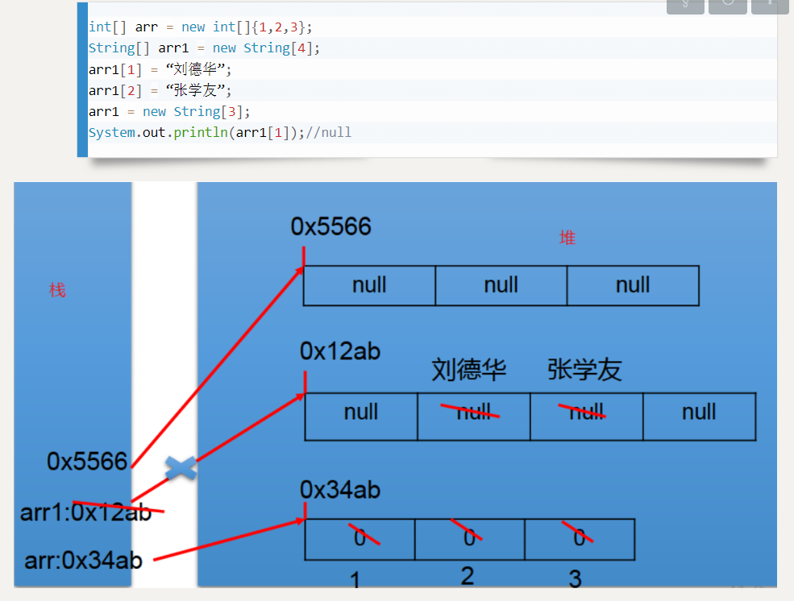
* 一维数组的内存解析
  ```java
  int[] arr = new int[]{1,2,3};
  String[] arr1 = new String[4];
  arr1[1] = “刘德华”;
  arr1[2] = “张学友”;
  arr1 = new String[3];
  System.out.println(arr1[1]);//null
  ```

 .png)

### 二维数组
* 理解
  1.  对于二维数组的理解，我们可以看成是一维数组array1又作为另一个一维数组array2的元素而存在。
  2.  其实，从数组底层的运行机制来看，其实没有多维数组。
* 二维数组的使用：
  1. 二维数组的初始化，代码案例——ArrayTest2.java
  2. 如何调用数组的指定位置的元素
  3. 如何获取数组的长度
  4. 如何遍历数组
  5. 数组元素的默认初始化值:见ArrayTest3.java
    ```java
    public class ArrayTest2 {
        public static void main(String[] args) {
          //1.二维数组的声明和初始化
          int[] arr = new int[]{1,2,3};
          //静态初始化
          int[][] arr1 = new int[][]{{1,2,3},{4,5,6},{7,8,9}};
          //动态初始化1
          String[][] arr2 = new String[3][2];
          //动态初始化2
          String[][] arr3 = new String[3][];
          
          //错误的情况
      //		String[][] arr4 = new String[][];
      //		String[][] arr5 = new String[][4];
      //		String[][] arr6 = new String[4][3]{{1,2,3},{4,5,6},{7,8,9}};
          
          //正确的情况：
          int arr4[][] = new int[][]{{1,2,3},{4,5,12,6},{7,8,9}};
          int[] arr5[] = new int[][]{{1,2,3},{4,5,6},{7,8,9}};
          int[][] arr6 = {{1,2,3},{4,5,6},{7,8,9}};		
          
          //2.如何调用数组的指定位置的元素
          System.out.println(arr1[0][1]);	//2
          System.out.println(arr2[1][1]);	//null
          
          arr3[1] = new String[4];	//定义arr3的[1]为长度为4的字符数组
          System.out.println(arr3[1][0]);	//没有上句，会报错
          
          //3.获取数组的长度
          System.out.println(arr4.length);	//3
          System.out.println(arr4[0].length);	//3
          System.out.println(arr4[1].length);	//4
          
          //4.如何遍历二维数组
          for(int i = 0;i < arr4.length;i++){
            for(int j = 0;j < arr4[i].length;j++){
              System.out.print(arr4[i][j] + " ");
            }
            System.out.println();
          }
        }
      }
    ```
### 数组的内存解析:见ArrayTest3.java

  * 规定：
    1.  二维数组分为外层数组的元素，内层数组的元素
    2.  int[][] arr = new int[4][3]; 
    3.  外层元素:arr[0],arr[1]等
    4.  内层元素:arr[0][0],arr[1][2]等

  * 数组元素的默认初始化值
    1.  针对于初始化方式一：比如：int[][] arr = new int[4][3];
    2. 	外层元素的初始化值为：地址值
    3.	内层元素的初始化值为：与一维数组初始化情况相同
    >>>
    1. 针对于初始化方式而二：比如：int[][] arr = new int[4][];
    2. 	外层元素的初始化值为：null，因为一维数组是引用类型
    3.  内层元素的初始化值为：不能调用，否则报错。
    ```java
    public class ArrayTest3 {
      public static void main(String[] args) {
        
        int[][] arr = new int[4][3];
        System.out.println(arr[0]);	//[I@15db9742
        System.out.println(arr[0][0]);	//0
        
    //		System.out.println(arr);	//ArrayTest3.java
        
        System.out.println("***********************");
        float[][] arr1 = new float[4][3];
        System.out.println(arr1[0]);	//地址值
        System.out.println(arr1[0][0]);	//0.0
        
        System.out.println("***********************");
        
        String[][] arr2 = new String[4][2];
        System.out.println(arr2[1]);	//地址值
        System.out.println(arr2[1][1]);	//null
        
        System.out.println("*********************");
        double[][] arr3 = new double[4][];
        System.out.println(arr3[1]);	//null
    //		System.out.println(arr3[1][0]);	//报错
      }
    }
    ```
* 二维数组的内存解析

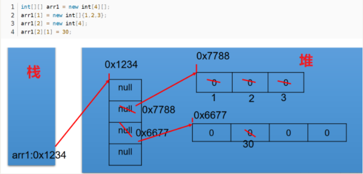

### 数组元素的排序算法
* 衡量排序算法的优劣
    1. 时间复杂度：分析关键字的比较次数和记录的移动次数
    2. 空间复杂度：分析排序算法中需要多少辅助内存
    3. 稳定性若两个记录 A 和 B 的关键字值相等，但排序后 A、B 的先后次序保持不变，则称这种排序算法是稳定的。
* 排序算法分类
    1. 内部排序：整个排序过程不需要借助于外部存储器（如磁盘等），所有排序操作都在内存中完成。
    2. 外部排序：参与排序的数据非常多，数据量非常大，计算机无法把整个排序过程放在内存中完成，必须借助于外部存储器（如磁盘）。
    外部排序最常见的是多路归并排序。可以认为外部排序是由多次内部排序组成。
* 排序算法性能对比

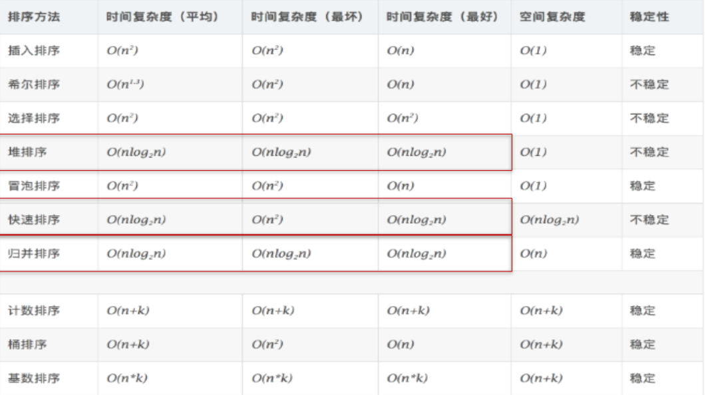

### 十大内部排序算法
* 选择排序
  * 直接选择排序、堆排序
* 交换排序
  * 冒泡排序、快速排序
* 插入排序
  * 直接插入排序、折半插入排序、Shell排序
* 归并排序
* 桶式排序
* 基数排序

### 数组中常见的算法
* 复制、反转

*  二分法查找
    ```java
    public class ArrayTest3 {
        public static void main(String[] args) {
          //二分法查找：
          //前提：所要查找的数组必须有序
          int[] arr2 = new int[]{-98,-34,2,34,54,66,79,105,210,333};
          
          int dest1 = -34;
          int head = 0;	//初始的首索引
          int end = arr2.length - 1;	//初始的末索引
          boolean isFlag1 = true;
          while(head <= end){
            int middle = (head + end)/2;
            
            if(dest1 == arr2[middle]){
              System.out.println("找到了指定元素，位置为：" + middle);
              isFlag1 = false;
              break;
            }else if(arr2[middle] > dest1){
              end = middle - 1;
            }else{	//arr2[middle] < dest1
              head = middle + 1;
            }	
          }
          
          if(isFlag1){
            System.out.println("很遗憾，没找到！");
          }		
        }
      }

    ```
* 冒泡排序

    
    ```java
          /*
      * 数组的冒泡排序的实现
      * 
      */
      public class BubbleSortTest {
        public static void main(String[] args) {
          
          int[] arr = new int[]{43,32,76,92,-65,85,71,-42};
          
          //冒泡排序
          for(int i = 0;i < arr.length - 1;i++){
            
            for(int j = 0;j < arr.length - 1 - i;j++){
              
              if(arr[j] > arr[j+1]){
                int temp = arr[j];
                arr[j] = arr[j+1];
                arr[j+1] = temp;
              }
            }
          }
          
          for(int i = 0;i < arr.length;i++){
            System.out.print(arr[i] + "\t");
          }
        }
      }

    ```
* 快速排序

### Arrays 工具类的使用
java.util.Arrays类即为操作数组的工具类，包含了用来操作数组（比如排序和搜索）的各种方法。
|  命令   | 作用  |
|  :----:  | :----:  |
| boolean equals(int[] a,int[] b)	  | 判断两个数组是否相等 |
| String toString(int[] a)  | 输出数组信息 |  
| void fill(int[] a,int val)  | 将指定值填充到数组之中 |
| void sort(int[] a)  | 对数组进行排序 | 
| int binarySearch(int[] a,int key)  | 对排序后的数组进行二分法检索指定的值 |
* Arrays 代码案例
    ```java
        import java.util.Arrays;
    /*
    * java.util.Arrays:作数组的工具类，包含了用来操作数组（比如排序和搜索）的各种方法。
    */
    public class ArrayTest4 {
      public static void main(String[] args) {
        
        //1.boolean equals(int[] a,int[] b)判断两个数组是否相等。
        int[] arr1 = new int[]{1,2,3,4};
        int[] arr2 = new int[]{1,2,9,3};
        boolean isEquals = Arrays.equals(arr1, arr2);
        System.out.println(isEquals);
        
        //2.String toString(int[] a)输出数组信息。
        System.out.println(Arrays.toString(arr1));		
        
        //3.void fill(int[] a,int val)将指定值填充到数组之中。
        Arrays.fill(arr1, 10);
        System.out.println(Arrays.toString(arr1));		
        
        //4.void sort(int[] a)对数组进行排序。
        Arrays.sort(arr2);
        System.out.println(Arrays.toString(arr2));
        
        //5.int binarySearch(int[] a,int key)对排序后的数组进行二分法检索指定的值。
        int[] arr3 = new int[]{43,32,76,92,-65,85,71,-42}; 
        int index = Arrays.binarySearch(arr3, 210);
        if(index >= 0){
          System.out.println(index);
        }else{
          System.err.println("未找到。");
        }		
      }
    }

    ```

### 数组使用中的常见异常
  1. 数组角标越界的异常:ArrayIndexOutOfBoundsException
  2. 空指针异常:NullPointerException
      ```java
      /*
      * 数组中的常见异常：
      * 1.数组角标越界的异常:ArrayIndexOutOfBoundsException
      * 
      * 2.空指针异常:NullPointerException
      * 
      */
     public class ArrayExceptionTest {
     	public static void main(String[] args) {
     		
     		//1.数组角标越界的异常:ArrayIndexOutOfBoundsException
     		int[] arr = new int[]{1,2,3,4,5,6};
     		
     		//错误1：
     		for(int i = 0;i <= arr.length;i++){
     			System.out.println(arr[i]);
     		}
     		
     		//错误2：
     		System.out.println(arr[-2]);
     		
     		//错误3
     		System.out.println("hello");
     		
     		//2.空指针异常:NullPointerException
     		//情况一:
     		int[] arr2= new int[]{1,2,3};
     		arr2 = null;
     		System.out.println(arr2[0]);
     		//情况二:
          int[][] arr2 = new int[4][];
     		System.out.println(arr2[0][0]);
     		
     		//情况三:
    		String[] arr3 = new String[]{"AA","QQ","YY","XX","TT","KK"};
     	  arr3[0] = null;
     		System.out.println(arr3[0].toString());		
     	}
     }

      ```

---

# 面向对象(上)

### 面向过程(POP)与面向对象(OOP)
何谓“面向对象”的编程思想？
首先解释一下“思想”。
先问你个问题：你想做个怎样的人？
可能你会回答：我想做个好人，孝敬父母，尊重长辈，关爱亲朋…
你看，这就是思想。这是你做人的思想，或者说，是你做人的原则。做人有做人的原则，编程也有编程的原则。这些编程的原则呢，就是编程思想。

* ==学习面向对象内容的三条主线==
  1. Java 类及类的成员：属性、方法、构造器、代码块、内部类
  2. 面向对象的三大特征：封装、继承、多态性、(抽象性)
  3. 其它关键字：this、super、static、final、abstract、interface、package、import 等
* 人把大象装进冰箱
    ```java
     * 1.面向过程:强调的是功能行为，以函数为最小单位，考虑怎么做。
     * 
     * ① 打开冰箱
     * ② 把大象装进冰箱
     * ③ 把冰箱门关住 
     * 
     * 2.面向对象:强调具备了功能的对象，以类/对象为最小单位，考虑谁来做。
     * 人{
     * 		打开(冰箱){
     * 			冰箱.开门();
     * 		}操作(大象){
     * 			大象.进入(冰箱);
     * 		}关闭(冰箱){
     * 			 冰箱.关门();     
     * 		}
     * }
     * 
     * 冰箱{
     * 		开门(){
     * 		}  
     * 		关门(){
     * 		}
     * }
     * 
     * 大象{
     * 		进入(冰箱){
     * 		}
     * }
     */
     ```

### 类和对象
* 面向对象的两个要素
    1. 类:对一类事物的描述，是抽象的、概念上的定义
    2. 对象:是实际存在的该类事物的每个个体，因而也称为实	例(instance)

可以理解为：类= 抽象概念的人；对象= 实实在在的某个人,面向对象程序设计的重点是类的设计；设计类，其实就是设计类的成员。

### Java 类及类的成员
  现实世界的生物体，大到鲸鱼，小到蚂蚁，都是由最基本的细胞构成的。同理，Java 代码世界是由诸多个不同功能的类构成的。

  现实生物世界中的细胞又是由什么构成的呢？细胞核、细胞质、… 那么，Java 中用类 class 来描述事物也是如此。常见的类的成员有：
  * 属性：对应类中的成员变量
  * 行为：对应类中的成员方法

### 类与对象的创建及使用
* 设计类、其实就是设计类的成员
    1. Field = 属性 = 成员变量 = 域、字段
    2. Method = (成员)方法 = 函数
    3. 创建类 = 类的实例化 = 实例化类
  
* ==类和对象的使用(面向对象思想落地的实现)==
    1. 创建类，设计类的成员
    2. 创建类的对象
    3. 通过“对象.属性”或“对象.方法”调用对象的结构 
* 如果创建类一个类的多个对象，则每个对象都独立的拥有一套类的属性。(非 static 的) 	  意味着:如果我们修改一个对象的属性 a，则不影响另外一个对象属性 a 的值。
    ```java
    //测试类
    public class PersonTest {
      public static void main(String[] args) {
        //2.创建 Person 类的对象
        //创建对象语法：类名对象名= new 类名();
        Person p1 = new Person();
        //Scanner scan = new Scanner(System.in);
        
        //调用类的结构：属性、方法
        //调用属性:“对象.属性”
        p1.name = "Tom";
        p1.age = 25;
        p1.isMale = true;
        System.out.println(p1.name);
        
        //调用方法:“对象.方法”
        p1.eat();
        p1.sleep();
        p1.talk("chinese");
        //**********************
        Person p2 = new Person();
        System.out.println(p2.name); //null
        System.out.println(p2.isMale);
        //**********************
        //将 p1 变量保存的对象地址值赋给 p3,导致 p1 和 p3 指向了堆空间中的一个对象实体。
        Person p3 = p1;
        System.out.println(p3.name);
        
        p3.age = 10;
        System.out.println(p1.age); //10
      }
    }
    /*
    * 类的语法格式：
    * 修饰符 class 类名{
    * 		属性声明;
    * 		方法声明;
    * }
    * 说明：修饰符 public：类可以被任意访问类的正文要用{  }括起来
    */
    //1.创建类，设计类的成员
    class Person{
      
      //属性:对应类中的成员变量
      String name;
      int age;
      boolean isMale;
      
      //方法:对应类中的成员方法
      public void eat(){
        System.out.println("吃饭");
      }
      
      public void sleep(){
        System.out.println("睡觉");
      }
      
      public void talk(String language){
        System.out.println("人可以说话，使用的是：" + language);
      }
    }
    ```
### 对象的创建和使用：内存解析
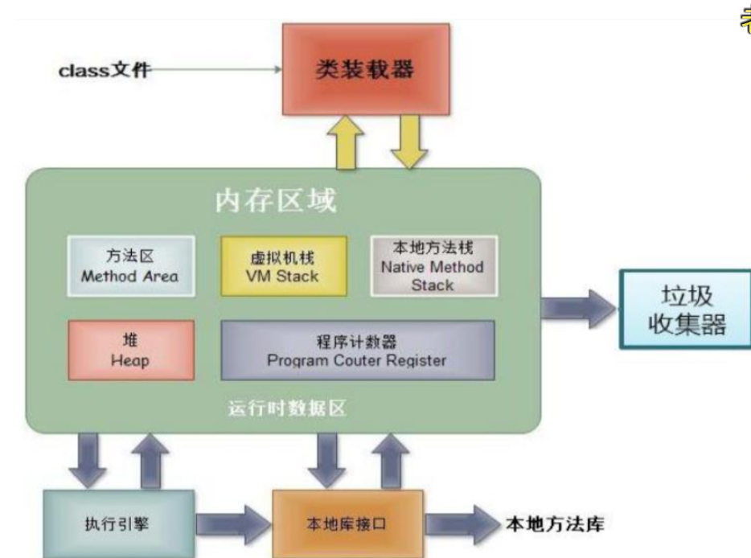
堆（Heap），此内存区域的唯一目的就是存放对象实例，几乎所有的对象实例都在这里分配内存。这一点在 Java 虚拟机规范中的描述是：所有的对象实例以及数组都要在堆上分配。
通常所说的栈（Stack），是指虚拟机栈。虚拟机栈用于存储局部变量等。局部变量表存放了编译期可知长度的各种基本数据类型（boolean、byte、char、short、int、float、long、double）、对象引用（reference 类型，它不等同于对象本身，是对象在堆内存的首地址）。方法执行完，自动释放。
方法区（MethodArea），用于存储已被虚拟机加载的类信息、常量、静态变量、即时编译器编译后的代码等数据。
* 案例1
  ```java
  Person p1= newPerson();
  p1.name = "Tom";
  p1.isMale = true;
  Person p2 = new Person();
  sysout(p2.name);//null
  Person p3 = p1;
  p3.age = 10;

  ```
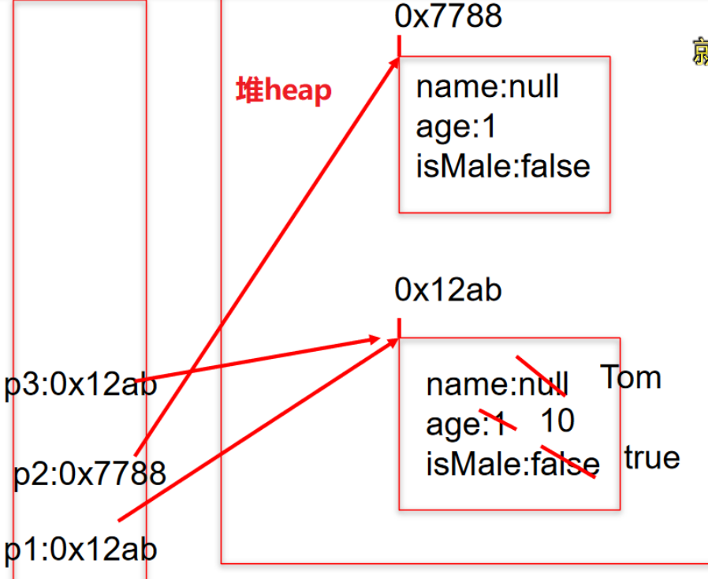

* 案例2

  ```java
    Person p1= newPerson();
    p1.name = "胡利民";
    p1.age = 23;
    Person p2 = new Person();
    p2.age = 10;
  ```
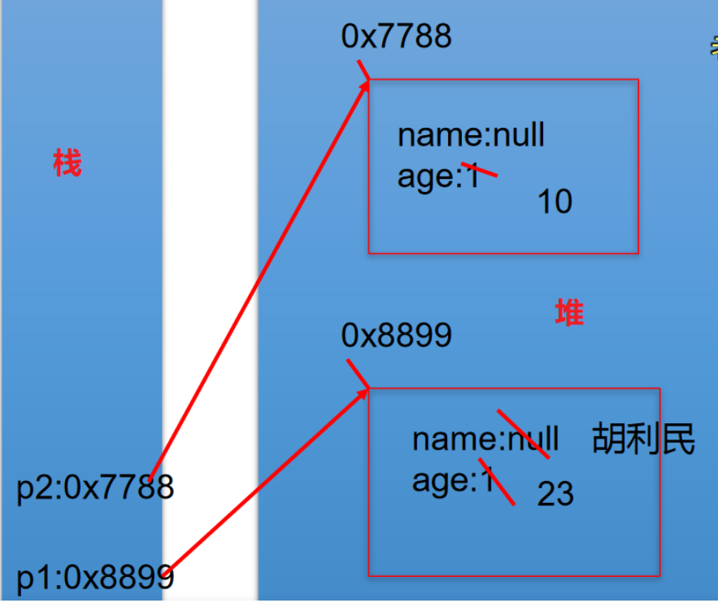

### 类的成员之一：属性
  * 类中属性属性(成员变量)	vs	局部变量
    * 相同点：
      1. 定义变量的格式:数据类型 变量名 = 变量值
      2. 先声明，后使用	1.
      3. 变量都有其对应的作用域			

    * 不同点：
      1.  **在类中声明的位置不同：**
      属性:直接定义在类的一对{}内
      局部变量:声明在方法内、方法形参、构造器形参、构造器内部的变量
           
      1.  **关于权限修饰符的不同：**
      属性:可以在声明属性时，指明其权限，使用权限修饰符。
          常用的权限修饰符:private、public、缺省、protected
     		  目前声明属性时，都使用缺省即可。
     		  局部变量:不可以使用权限修饰符。
      2.  **默认初始化值的情况:**
      属性:类的属性，根据其类型，都有默认初始化值。
     			整型(byte、short、int、long):0
     			浮点型(float、double):0.0
     			字符型(char):0(或‘\u0000’)
     			布尔型(boolean):false
          引用数据类型(类、数组、接口):null
          局部变量:没有默认初始化值
     			意味着:在调用局部变量之前，一定要显式赋值。
     			特别地:形参在调用时,赋值即可。例，45 行
      3.  **在内存中加载的位置，亦各不相同**
      	属性:加载到堆空间中(非 static)
     		局部变量:加载到栈空间
  
    ```java
    public class UserTest {
      public static void main(String[] args) {
        User u1 = new User();
        System.out.println(u1.name);
        System.out.println(u1.age);
        System.out.println(u1.isMale);
        
        u1.talk("俄语");
      }
    }
    class User{
      //属性(或成员变量)
      String name;	//不加 private 即为缺省
      public int age;	//不加 public 即为缺省
      boolean isMale;
      
      public void talk(String language){//language:形参，也是局部变量
        System.out.println("我们使用" + language + "进行交流。");
      }
      
      public void eat(){
        String food = "石头饼";	//石头饼:局部变量
        System.out.println("北方人喜欢吃:" + food);
      }
    }

    ```
### 类的成员之二：方法

##### 类中方法的声明和使用
* 类中方法的声明和使用
    ```java
      /*
    * 类中方法的声明和使用
    * 
    * 方法：描述类应该具有的功能。
    * 比如：Math类：sqrt()\random() \...
    *     Scanner类：nextXxx() ...
    *     Arrays类：sort() \ binarySearch() \ toString() \ equals() \ ...
    * 
    * 1.举例：
    * public void eat(){}
    * public void sleep(int hour){}
    * public String getName(){}
    * public String getNation(String nation){}
    * 
    * 2. 方法的声明：权限修饰符  返回值类型  方法名(形参列表){
    * 					方法体
    * 			  }
    *   注意：static、final、abstract 来修饰的方法，后面再讲。
    *   
    * 3. 说明：
    * 		3.1 关于权限修饰符：默认方法的权限修饰符先都使用public
    * 			Java规定的4种权限修饰符：private、public、缺省、protected  -->封装性再细说
    * 
    * 		3.2 返回值类型： 有返回值  vs 没有返回值
    * 			3.2.1  如果方法有返回值，则必须在方法声明时，指定返回值的类型。同时，方法中，需要使用
    *                return关键字来返回指定类型的变量或常量：“return 数据”。
    * 				  如果方法没有返回值，则方法声明时，使用void来表示。通常，没有返回值的方法中，就不需要
    *               使用return.但是，如果使用的话，只能“return;”表示结束此方法的意思。
    * 
    * 			3.2.2 我们定义方法该不该有返回值？
    * 				① 题目要求
    * 				② 凭经验：具体问题具体分析
    * 
    *      3.3 方法名：属于标识符，遵循标识符的规则和规范，“见名知意”
    *      3.4 形参列表:方法名可以声明0个、1个，或多个形参。
    *      	3.4.1 格式:数据类型1 形参1，数据类型2 形参2,...
    *      
    *      	3.4.2 我们定义方法时，该不该定义形参？
    *      		① 题目要求
    *      		② 凭经验，具体问题具体分析
    *      3.5 方法体:方法功能的体现。
    *  4. return关键字的使用：
    *  	1.使用范围:使用在方法体中
    *  	2.作业:① 结束方法
    *  		  ② 针对于有返回值类型的方法，使用"return 数据"方法返回所要的数据。
    *  	3.注意点:return关键字后不可声明执行语句。
    *  5. 方法的使用中，可以调用当前类的属性或方法。
    *  		特殊的:方法A中又调用了方法A:递归方法。
    *  	方法中不能定义其他方法。
    */
    public class CustomerTest {
      public static void main(String[] args) {
        
        Customer cust1 = new Customer();
        
        cust1.eat();
        
        //测试形参是否需要设置的问题
    //		int[] arr = new int[]{3,4,5,2,5};
    //		cust1.sort();
        
        cust1.sleep(8);
        
      }
    }
    //客户类
    class Customer{
      
      //属性
      String name;
      int age;
      boolean isMale;
      
      //方法
      public void eat(){
        System.out.println("客户吃饭");
        return;
        //return后不可以声明表达式
    //		System.out.println("hello");
      }
      
      public void sleep(int hour){
        System.out.println("休息了" + hour + "个小时");
        
        eat();
    //		sleep(10);
      }
      
      public String getName(){
        
        if(age > 18){
          return name;
          
        }else{
          return "Tom";
        }
      }
      
      public String getNation(String nation){
        String info = "我的国籍是：" + nation;
        return info;
      }
      
      //体会形参是否需要设置的问题
    //	public void sort(int[] arr){
    //		
    //	}
    //	public void sort(){
    //		int[] arr = new int[]{3,4,5,2,5,63,2,5};
    //		//。。。。
    //	}
      
      public void info(){
        //错误的
    //		public void swim(){
    //			
    //		}
        
      }
    }
    ```

  * [<font color=red>练习1</font>](practice/java/practice/Person.java) + [<font color=red>测试</font>](practice/java/practice/PersonTest.java)
  * [<font color=red>练习2</font>](practice/java/practice/CircleTest.java)
  * [<font color=red>练习3</font>](practice/java/practice/ExerTest.java)
  * [<font color=red>练习4</font>](practice/java/practice/StudentTest.java)
  * [<font color=red>练习4优化</font>](practice/java/practice/StudentTest2.java)

##### 理解”万事万物皆对象“
1.在Java语言范畴中，我们都将功能、结构等封装到类中，通过类的实例化，来调用具体的功能结构。
 	    》Scanner,String等
  		》文件：File
  		》网络资源：URL
2.涉及到Java语言与前端html、后端的数据库交互时，前后端的结构在Java层面交互时，都体现为类、对象。

##### 对象数组的内存解析
* 引用类型的变量，只可能存储量两类值：null或地址值（含变量类型）
  ```java
  /*引用类型的变量，只可能存储量两类值：null或地址值（含变量类型）*/
  Student[] stus= new Student[5];
  stus[0] = new Student();
  sysout(stus[0].state);//1
  sysout(stus[1]);//null
  sysout(stus[1].number);//异常
  stus[1] = new Student();
  sysout(stus[1].number);//0

  class Student{
    int number;//学号
    int state = 1;//年级
    int score;//成绩
  }

    ```
  

##### 匿名对象的使用

* 理解
  * 我们创建的对象，没有显示的赋值给一个变量名。即为匿名对象  
* 特征
  * 匿名对象只能调用一次。
* [<font color=red>例题</font>](practice/java/practice/InstanceTest.java)

##### 自定义数组的工具类
* [<font color=red>工具类</font>](practice/java/practice/ArrayUtilTest.java)

##### 方法的重载(overload)
* 定义：
  * 在同一个类中，允许存在一个以上的同名方法，只要它们的参数个数或者参数类型不同即可。
  ```java
  /* 		“两同一不同”:同一个类、相同方法名
  * 				  参数列表不同：参数个数不同，参数类型不同
  * 
  * 2.举例:*/
   		Arrays类中重载的sort() / binarySearch()
  ```

* 判断是否重载：
  * 与方法的返回值类型、权限修饰符、形参变量名、方法体都无关。
* 在通过对象调用方法时，如何确定某一个指定的方法：
  * 方法名---》参数列表

  ```java
  public class OverLoadTest {
    
    public static void main(String[] args) {
      OverLoadTest test = new OverLoadTest();
      test.getSum(1, 2);	//调用的第一个，输出1
    }

    //如下的四个方法构成了重载
    public void getSum(int i,int j){
      System.out.println("1");
    }
    public void getSum(double d1,double d2){
      System.out.println("2");
    }
    public void getSum(String s,int i){
      System.out.println("3");
    }
    
    public void getSum(int i,String s){
      
    }
    
    //以下3个是错误的重载
  //	public int getSum(int i,int j){
  //		return 0;
  //	}
    
  //	public void getSum(int m,int n){
  //		
  //	}
    
  //	private void getSum(int i,int j){
  //		
  //	}
  }
  ```
  1、[<font color=red>举例</font>](practice/ifreload)
  2、[<font color=red>编程</font>](practice/java/practice/OverLoad.java)

##### [<font color=red>可变个数的形参</font>](practice/MethodArgs.java)
JavaSE 5.0 中提供了Varargs(variable number of arguments)机制，允许直接定义能和多个实参相匹配的形参。从而，可以用一种更简单的方式，来传递个数可变的实参。

##### 方法参数的值传递机制(重点！！！)
* [<font color=red>关于变量的赋值</font>](practice/java/practice/ValueTransferTest.java)
  1. 如果变量是基本数据类型，此时赋值的是变量所保存的数据值
  2. 如果变量是引用数据类型，此时赋值的是变量所保存的数据的地址值 
* [<font color=red>针对基本数据类型</font>](practice/java/practice/ValueTransferTest1.java)
  1. 形参：方法定义时，声明的小括号内的参数
    实参：方法调用时，实际传递给形参的数据
  
  2. 值传递机制：
   如果参数是基本数据类型，此时实参赋值给形参的是实参真是存储的数据值。

* [<font color=red>针对引用数据类型</font>](practice/java/practice/ValueTransferTest2.java)
  * 如果参数是引用数据类型，此时实参赋值给形参的是实参存储数据的地址值。
  


* [<font color=red>练习1:</font>](practice/java/practice/ArrayPrint.java)
* [<font color=red>练习2:</font>](practice/java/practice/PassObject.java)

##### 递归(recursion)方法
* 递归方法：一个方法体内调用它自身。
* 方法递归包含了一种隐式的循环，它会重复执行某段代码，但这种重复执行无须循环控制。
* 递归一定要向已知方向递归，否则这种递归就变成了无穷递归，类似于死循环。
  ```java
  public class RecursionTest {

	public static void main(String[] args) {

		// 例1:计算1-100之间所有自然数的和
		// 方法1:
		int sum = 0;
		for (int i = 1; i <= 100; i++) {
			sum += i;
		}
		System.out.println("sum = " + sum);

		// 方法2:
		RecursionTest test = new RecursionTest();
		int sum1 = test.getSum(100);
		System.out.println("sum1 = " + sum1);
	}

	// 例1:计算1-n之间所有自然数的和
	public int getSum(int n) {

		if (n == 1) {
			return 1;
		} else {
			return n + getSum(n - 1);
		}
	}

	// 例2:计算1-n之间所有自然数的乘积
	//归求阶乘(n!)的算法
	public int getSum1(int n) {


		if (n == 1) {
			return 1;
		} else {
			return n * getSum1(n - 1);
		}
	}
  }
  ```
### 面向对象特征之一：封装与隐藏
 1.  封装性的引入与体现
      * 为什么需要封装？封装的作用和含义？
我要用洗衣机，只需要按一下开关和洗涤模式就可以了。有必要了解洗衣机内部的结构吗？有必要碰电动机吗？
我要开车
 2.  我们程序设计追求“高内聚，低耦合”
       *  高内聚：类的内部数据操作细节自己完成，不允许外部干涉
       *  低耦合：仅对外暴露少量的方法用于使用
3. 隐藏对象内部的复杂性，只对外公开简单的接口
      * 把该隐藏的隐藏起来，该暴露的暴露出来。这就是封装性的设计思想
        ```java
          /*
        * 一、问题的引入：
        *    当我们创建一个类的对象以后，我们可以通过"对象.属性"的方式，对对象的属性进行赋值。这里，赋值操作要受到
        *    属性的数据类型和存储范围的制约。但除此之外，没有其他制约条件。但是，实际问题中，我们往往需要给属性赋值
        *    加入额外限制条件。这个条件就不能在属性声明时体现，我们只能通过方法进行条件的添加。比如说，setLegs
        *    同时，我们需要避免用户再使用“对象.属性”的方式对属性进行赋值。则需要将属性声明为私有的(private)
        *    --》此时，针对于属性就体现了封装性。
        *    
        * 二、封装性的体现：
        *    我们将类的属性私有化(private),同时,提供公共的(public)方法来获取(getXxx)和设置(setXxx)
        *    
        *    拓展：封装性的体现：① 如上 ② 单例模式 ③ 不对外暴露的私有方法
        *
        */
        public class AnimalTest {

          public static void main(String[] args) {
            Animal a = new Animal();
            a.name = "大黄";
        //		a.age = 1;
        //		a.legs = 4;//The field Animal.legs is not visible
            
            a.show();
            
        //		a.legs = -4;
        //		a.setLegs(6);
            a.setLegs(-6);
            
        //		a.legs = -4;//The field Animal.legs is not visible
            a.show();
            
            System.out.println(a.name);
            System.out.println(a.getLegs());
          }
        }
        class Animal{
          
          String name;
          private int age;
          private int legs; //腿的个数
          
          //对于属性的设置
          public void setLegs(int l){
            if(l >= 0 && l % 2 == 0){
              legs = l;
            }else{
              legs = 0;
            }
          }
          
          //对于属性的获取
          public int getLegs(){
            return legs;
          }
          
          public void eat(){
            System.out.println("动物进食");
          }
          
          public void show(){
            System.out.println("name = " + name + ",age = " + age + ",legs = " + legs);
          }
          
          //提供关于属性 age 的 get 和 set 方法
          public int getAge(){
            return age;
          }
          
          public void setAge(int a){
            age = a;
          }
        }
        ``` 

##### 四种权限修饰符的理解与测试


* 对于 class 的权限修饰只可以用 public 和 default(缺省)
  * public 类可以在任意地方被访问
  * default 类只可以被同一个包内部的类访问
* 封装性的体现，需要权限修饰符来配合
   1. Java 规定的 4 种权限：(从小到大排序)private、缺省、protected、public

  1. 4 种权限用来修饰类及类的内部结构：属性、方法、构

  2. 具体的，4 种权限都可以用来修饰类的内部结构：属性、方法、构造器、内部类，修饰类的话，只能使用：缺省、public

  3. 总结封装性：Java 提供了 4 中权限修饰符来修饰类积累的内部结构，体现类及类的内部结构的可见性的方法

  1、Order 类
    ```java
    public class Order {

      private int orderPrivate;
      int orderDefault;
      public int orderPublic;
      
      private void methodPrivate(){
        orderPrivate = 1;
        orderDefault = 2;
        orderPublic = 3;
      }
      
      void methodDefault(){
        orderPrivate = 1;
        orderDefault = 2;
        orderPublic = 3;
      }
      
      public void methodPublic(){
        orderPrivate = 1;
        orderDefault = 2;
        orderPublic = 3;
      }
    }
    ```
  2.OrderTest 类
    ```java
    public class OrderTest {

      public static void main(String[] args) {
        
        Order order = new Order();
        
        order.orderDefault = 1;
        order.orderPublic = 2;
        //出了 Order 类之后，私有的结构就不可调用了
    //		order.orderPrivate = 3;//The field Order.orderPrivate is not visible
        
        order.methodDefault();
        order.methodPublic();
        //出了 Order 类之后，私有的结构就不可调用了
    //		order.methodPrivate();//The method methodPrivate() from the type Order is not visible
      }
    }
    ```
  3.相同项目不同包的 OrderTest 类
    ```java
    import github.Order;
    public class OrderTest {

      public static void main(String[] args) {
        Order order = new Order();
        
        order.orderPublic = 2;
        //出了 Order 类之后，私有的结构、缺省的声明结构就不可调用了
    //		order.orderDefault = 1;
    //		order.orderPrivate = 3;//The field Order.orderPrivate is not visible
        
        order.methodPublic();
        //出了 Order 类之后，私有的结构、缺省的声明结构就不可调用了
    //		order.methodDefault();
    //		order.methodPrivate();//The method methodPrivate() from the type Order is not visible
      }
    }
    ```

### 类的成员三：构造器(构造方法)
##### 构造器的理解
* 构造器的作用
  1. 创建对象
  2. 初始化对象的属性
* 说明
  1. 如果没有显示的定义类的构造器的话，则系统默认提供一个空参的构造器。
  2. 定义构造器的格式:权限修饰符  类名(形参列表) { }
  3. 一个类中定义的多个构造器，彼此构成重载。
  4. 一旦显示的定义了类的构造器之后，系统不再提供默认的空参构造器。
  5. 一个类中，至少会有一个构造器	
  
  ```java
  public class PersonTest {
    public static void main(String[] args) {
      //创建类的对象:new + 构造器
      Person p = new Person();	//Person()这就是构造器
      
      p.eat();
      
      Person p1 = new Person("Tom");
      System.out.println(p1.name);
    }
  }
  class Person{
    //属性
    String name;
    int age;
    
    //构造器
    public Person(){
      System.out.println("Person()......");
    }
    
    public Person(String n){
      name = n;
    }
    
    public Person(String n,int a){
      name = n;
      age = a;
    }
    
    //方法
    public void eat(){
      System.out.println("人吃饭");
    }
    
    public void study(){
      System.out.println("人学习");
    }
  }
  ```
##### 总结属性赋值的过程
* 属性赋值的先后顺序
  * ① 默认初始化值
  * ② 显式初始化
  * ③ 构造器中赋值
  * ④ 通过"对象.方法" 或 “对象.属性”的方式，赋值

##### JavaBean 的使用
JavaBean 是一种 Java 语言写成的可重用组件。
* javaBean，是指符合如下标准的 Java 类：
  *  类是公共的
  *  有一个无参的公共的构造器
  *  有属性，且有对应的 get、set 方法

  ```java
  public class Customer {     //类是公共的
    
    private int id;
   
    public Customer(){        //无参公共构造器
      
    }
    
    public void setId(int i){   //set方法
      id = i; 
    }
    
    public int getId(){         //get方法
      return id;
    }
  }
  ```

#### UML类图

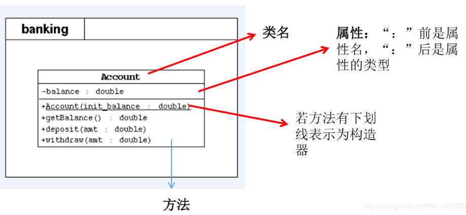

> +表示 public 类型，-表示 private 类型，#表示 protected 类型
方法的写法: 方法的类型(+、-) 方法名(参数名：参数类型)：返回值类型

### 关键字this的使用

##### this 调用属性、方法、构造器
* 使用：
  1. this 用来修饰、调用：属性、方法、构造器
  2. this 修饰属性和方法。理解为：当前对象,或当前正在创建的对象。
  3. 在类的方法中，我们可以使用"this.属性"或"this.方法"的方式，调用当前对象属性和方法。
  通常情况下，我们都选择省略“this.”。特殊情况下，如果方法的形参和类的属性同名，我们必须显式
  的使用"this.变量"的方式，表明此变量是属性，而非形参。
  4. 在类的构造器中，我们可以使用"this.属性"或"this.方法"的方式，调用正在创建的对象属性和方法。
   	但是，通常情况下，我们都选择省略“this.”。特殊情况下，如果构造器的形参和类的属性同名，我们必须显式
   	的使用"this.变量"的方式，表明此变量是属性，而非形参。
  5. this 调用构造器
   	① 我们可以在类的构造器中，显式的使用"this(形参列表)"的方式，调用本类中重载的其他的构造器！
   	② 构造器中不能通过"this(形参列表)"的方式调用自己。
   	③ 如果一个类中声明了n个构造器，则最多有n -1个构造器中使用了"this(形参列表)"。
   	④ "this(形参列表)"必须声明在类的构造器的首行！
   	⑤ 在类的一个构造器中，最多只能声明一个"this(形参列表)"。
    ```java
    public class PersonTest {

      public static void main(String[] args) {
        Person p1 = new Person();
        
        p1.setAge(1);
        System.out.println(p1.getAge());
        
        p1.eat();
        System.out.println();
        
        Person p2 = new Person("jerry" ,20);
        System.out.println(p2.getAge());
      }
    }
    class Person{
      
      private String name;
      private int age;
      
      public Person(){
        this.eat();
        String info = "Person 初始化时，需要考虑如下的 1,2,3,4...(共 40 行代码)";
        System.out.println(info);
      }
      
      public Person(String name){
        this();
        this.name = name;
      }
      
      public Person(int age){
        this();
        this.age = age;
      }
      
      public Person(String name,int age){
        this(age);	//调用构造器的一种方式
        this.name = name;
    //		this.age = age;
      }
      
      public void setNmea(String name){
        this.name = name;
      }
      
      public String getName(){
        return this.name;
      }
      
      public void setAge(int age){
        this.age = age;
      }
      
      public int getAge(){
        return this.age;
      }
      
      public void eat(){
        System.out.println("人吃饭");
        this.study();
      }
      
      public void study(){
        System.out.println("学习");
      }
    }
    ```
### 关键字：package、import 的使用

##### 关键字—package
* package 关键字的使用
  1. 为了更好的实现项目中类的管理，提供包的概念
  2. 使用 package 声明类或接口所属的包，声明在源文件的首行
  3. 包，属于标识符，遵循标识符的命名规则、规范"见名知意"
  4. 每“.”一次,就代表一层文件目录。注： 同一个包下，不能命名同名接口或同名 
  不同包下，可以命名同名的接口、类。
* JDK 中主要的包介绍
  1. java.lang----包含一些 Java 语言的核心类，如 String、Math、Integer、System 和 Thread，提供常用功能
  2. java.net----包含执行与网络相关的操作的类和接口。
  3. java.io----包含能提供多种输入/输出功能的类。
  4. java.util----包含一些实用工具类，如定义系统特性、接口的集合框架类、使用与日期日历相关的函数。
  5.  java.text----包含了一些 java 格式化相关的类
  6. java.sql----包含了 java 进行 JDBC 数据库编程的相关类/接口
  7. java.awt----包含了构成抽象窗口工具集（abstractwindowtoolkits）的多个类，这些类被用来构建和管理应用程序的图形用户界面(GUI)。B/S  C/S


##### MVC 设计模式
* 视图层模型层
* 控制器层
* 数据模型层
MVC 是常用的设计模式之一，将整个程序分为三个层次：视图模型层，控制器层，数据模型层。这种将程序输入输出、数据处理，以及数据的展示分离开来的设计模式使程序结构变的灵活而且清晰，同时也描述了程序各个对象间的通信方式，降低了程序的耦合性。


##### 关键字-import
* import关键字的使用
  1. 在源文件中显式的使用import结构导入指定包下的类、接口
  2. 声明在包的声明和类的声明之间
  3. 如果需要导入多个结构，则并列写出即可
  4. 可以使用"xxx.*"的方式,表示可以导入xxx包下的所有结构。
  5. 如果导入的类或接口是java.lang包下的，或者是当前包下的，则可以省略此import语句。
  6. 如果在代码中使用不同包下的同名的类。那么就需要使用类的全类名的方式指明调用的是哪个类。
  7. 如果已经导入java.a包下的类。那么如果需要使用a包的子包下的类的话，仍然需要导入。
  8. import static组合的使用：调用指定类或接口下的静态的属性或方法.

# 面向对象(中)

### 继承性的使用与理解   
* 继承性的好处
  1.  减少了代码的冗余，提高了代码的复用性
  2.  便于功能的扩展
  3.  为之后多态性的使用，提供了前提

* 继承性的格式：class A extends B{}
  1.  A:子类、派生类、subclass
  2.  B:父类、超类、基类、superclass
  3.  体现：一旦子类A继承父类B以后。子类A中就获取了父类B中声明的结构（属性、私有属性、方法）
  4.  子类继承父类以后，还可以定义自己特有的属性方法，实现功能的拓展
* java中关于继承性的规定
  1. 一个类可以被多个子类继承
  2. java中类的单继承性(一个类只能有一个父类)
  3. 子父类是相对的概念
  4. 子类直接继承的父类，称为：直接父类。间接继承的父类称为：间接父类
  5. 子类继承父类以后，就获取了直接父类以及间接父类中声明的属性和方法
* object类的理解
  1. 如果我们没有显示的声明一个类的父类的化，则此类继承于java.lang.Object类
  2. 所有的java类（除java.lang.Object类之外）都直接或间接的继承于java.lang.object类
  3. 意味着，所有的java类具有java.lang.object类声明的功能 


### 方法的重写(override/overwrite)
* 重写：子类继承父类以后，可以对父类中同名同参的方法，进行覆盖操作
* 应用：重写以后，当创建子类对象以后，通过子类对象调用子父类中的同名参数的方法时，实际执行的是子类重写父类的的方法
* 重写的规定：
  * 方法的声明：权限修饰符 返回值类型 方法名（）throws 异常的类型{}
  * 约定俗称：子类中的叫重写的方法，父类中的叫被重写的方法
    1. 子类重写的方法的方法名和形参列表与父类被重写的方法名和形参列表相同
    2. 子类重写的方法的权限修饰符==不小于==父类被重写的方法的权限修饰符。==注：子类不能重写父类中声明为private的方法==
    3. 父类被重写的方法的返回值类型是void,则子类重写的方法的返回值类型只能是void
    4. 父类被重写的方法的返回值类型是A类型，则子类重写的方法的返回值类型可以是A类或A类的子类; 
    5. 父类被重写的方法的返回值类型如果是基本数据类型(比如:double)，则子类重写的方法的返回值类型必须是相同的基本数据类型(必须是:double)
    6. 子类方法抛出的异常不能大于父类被重写的方法抛出的异常
  * ==注意：子类与父类中同名同参数的方法必须同时声明为非static的(即为重写)，或者同时声明为static的（不是重写）==
    因为static方法是属于类的，子类无法覆盖父类的方法。

### super关键字的使用
* super调用属性和方法
  1. super理解为：父类的
  2. super可以用来调用：属性，方法，构造器
  3. 我们可以在子类的方法或构造器中，通过"super.属性"或"super.方法"的方式，显式的调用父类中声明的属性或方法。但是，通常情况下，我们习惯去省略这个"super."
  4. 特殊情况:当子类和父类中定义了同名的属性时，我们要想在子类中调用父类中声明的属性，则必须显式的 使用"super.属性"的方式，表明调用的是父类中声明的属性。
  5. 特殊情况:当子类重写了父类中的方法后，我们想在子类的方法中调用父类中被重写的方法时，必须显式的使用"super.方法"的方式，表明调用的是父类中被重写的方法。
  
* super调用构造器
  1.  我们可以在子类的构造器中显式的使用"super(形参列表)"的方式,调用父类中声明的指定的构造器
  2. super(形参列表)"的使用，必须声明在子类构造器的首行！
  3. 我们在类的构造器中，针对于"this(形参列表)"或"super(形参列表)"只能二选一，不能同时出现。
  4.  在构造器的首行，既没有显式的声明"this(形参列表)"或"super(形参列表)",则默认的调用的是父类中的空参构造器。super()
  5.  在类的多个构造器中，至少有一个类的构造器使用了"super(形参列表)",调用父类中的构造器。

### 子类对象的实例化过程
  * 从结果上看：子类继承父类以后，就获取了父类中声明的属性或方法。
  创建子类的对象中，在堆空间中，就会加载所有父类中声明的属性。

  * 从过程看：当我们通过子类的构造器创建子类对象时,我们一定会直接或间接的调用其父类构造器，直到调用了java.lang.Object类中空参的构造器为止。正因为加载过所有的父类结构，所以才可以看到内存中有父类中的结构，子类对象可以考虑进行调用。
  
  * 练习bank([<font color=red>Account</font>](practice/java/practice/Account.java),[<font color=red>AccountTest</font>](practicejava/practice//AccountTest.java),[<font color=red>CheckAccount</font>](practice/java/practice/CheckAccount.java),[<font color=red>CheckAccountTest</font>](practice/java/practice/CheckAccountTest.java))

### 多态性

* 面向对象之三:多态性
  1. 理解多态性:可以理解为一个事物的多种态性。
  2. 何为多态性:对象的多态性:父类的引用指向子类的对象(或子类的对象赋值给父类的引用)
  
  3. 多态的使用：虚拟方法调用
  	有了对象多态性以后，我们在编译期，只能调用父类声明的方法，但在执行期实际执行的是子类重写父类的方法
  			简称：编译时，看左边；运行时，看右边。
   
   若编译时类型和运行时类型不一致，就出现了对象的多态性(Polymorphism)
   多态情况下，
   	“看左边”：看的是父类的引用（父类中不具备子类特有的方法）
   	“看右边”：看的是子类的对象（实际运行的是子类重写父类的方法）
   
   4. 多态性的使用前提：
  	① ==类的继承关系==
  	② ==方法的重写==
   5. 对象的多态性:==只适用于方法，不适用于属性(编译和运行都看左边)==

    ```java
        /*
    * 多态性应用举例
    */
    public class AnimalTest {
      
      public static void main(String[] args) {
        AnimalTest test = new AnimalTest();
        test.func(new Dog());
        
        test.func(new Cat());
      }

      public void func(Animal animal){	//Animal animal = new Dog();
        animal.eat();
        animal.shout();
      }
      
      //如果没有多态性，就会写很多如下的方法，去调用
      public void func(Dog dog){
        dog.eat();
        dog.shout();
      }
      
      public void func(Cat cat){
        cat.eat();
        cat.shout();
      }
    }

    class Animal{
      
      public void eat(){
        System.out.println("动物，进食");
      }
      
      public void shout(){
        System.out.println("动物：叫");
      }
    }
    //如果没有多态性就要写下面的这些
    class Dog extends Animal{
      public void eat(){
        System.out.println("狗吃骨头");
      }
      
      public void shout() {
        System.out.println("汪！汪！汪！");
      }
    }

    class Cat extends Animal{
      public void eat(){
        System.out.println("猫吃鱼");
      }
      
      public void shout() {
        System.out.println("喵！喵！喵！");
      }
    }
    ```
##### 虚拟方法的补充
  * 从编译和运行的角度看：
    * 重载，是指允许存在多个同名方法，而这些方法的参数不同。
    编译器根据方法不同的参数表，对同名方法的名称做修饰。
    对于编译器而言，这些同名方法就成了不同的方法。
    它们的调用地址在编译期就绑定了。Java的重载是可以包括父类和子类的，
    即子类可以重载父类的同名不同参数的方法。所以：对于重载而言，在方法调用之前，
  编译器就已经确定了所要调用的方法，这称为“早绑定”或“静态绑定”；
  而对于多态，只有等到方法调用的那一刻，解释运行器才会确定所要调用的具体方法，
  这称为“晚绑定”或“动态绑定”。 
  引用一句Bruce Eckel的话：“不要犯傻，如果它不是晚绑定，它就不是多态。”
  
#### 向下转型的使用 
  1. 有了对象的多态性以后，内存中实际上是加载了子类特有的属性和方法，但是由于变量声明为父类类型，导致编译时，只能调用父类中声明的属性和方法。子类的属性和方法不能调用。
  2. 如何才能调用子类所特有的属性和方法？
  3. 解决方法：使用强制类型转换符，强制转换为子类类型，也可称为:向下转型
                                                                 
#### instanceof 关键字都使用
 * a instanceof A:判断对象a是否是类A的实例。如果，返回true，如果不是，返回false
 * 使用情境:为了避免在向下转型时出现ClassCastException异常，我们在进行向下转型之前，先进行 instanceof的判断,一旦返回true,就进行向下转型。如果返回false，不进行向下转型。

### Object类都的使用
1. Object类是所有Java类的根父类
2. 如果在类的声明中未使用extends关键字指明其父类，则默认父类为java.lang.Object类
3. Object类中的功能(属性、方法)就具有通用性
4. Object类只声明了一个空参的构造器
5. 方法:equals() / toString() / getClass() / hashCode() / clone() /[<font color=red>finalize()</font>](practice/java/practice/testFinalize.java)
 * 	 wait() 、notify()、notifyAll()


##### object类的主要对象


* **运算符**
  1. 可以使用在基本数据类型变量和引用数据类型变量中，
	1.  如果比较的是基本数据类型变量，比较两个变量保存的数据是否相等(不一定类型相同)
	3.	如果比较的是引用数据类型变量：比较两个对象的地址值是否相同,即两个引用是否指向同一个对象实体
  4. 补充: == 符号使用时，必须保证符号左右两边的变量类型一致


*  **equals()方法的使用**
  1. 是一个方法，而非运算符
  2. 只能适用于引用数据类型
  3. Object类中equals()的定义：
  		public boolean equals(Object obj){
  			return (this == obj);
  		}
  4. 像String、Date、File、包装类等都重写了Object类中的equals()方法.
      两个引用的地址是否相同，而是比较两个对象的“实体内容”是否相同。
  5. 通常情况下，我们自定义的类如果使用equals()的话，也通常是比较两个对象的"实体内容"是否相同。那么，我们就需要对Object类中的equals()进行重写。
  6. 重写的原则:比较两个对象的实体内容是否相同。

      ```java
      public class EqualTest{
      public static void main(String[] args){
        int i = 10,j=10;
        double d =10.0;
        System.out.println(i == j);	//true
        System.out.println(i == d); //true
        //引用数据类型
        Customer cust1 = new Customer("Tom" ,21);
		    Customer cust2 = new Customer("Tom" ,21);
        System.out.println(cust1.equals(cust2));	//false
        System.out.println(str1 == str2); //false


        //注意，注意·：：
        String str1 = new String("BAT");
		    String str2 = new String("BAT");
        System.out.println(str1.equals(str2));	//true
        System.out.println(str1 == str2); //false  “==”依然是false,而equasl方法是true,说明重写了
      }
      }
      ```
* **toString()的使用**
  1. 当我们输出一个引用，实际上就是调用当前对象的toString()
  2. Object类中toString的定义方法
  public String toString() {
       return getClass().getName() + "@" + Integer.toHexString(hashCode());
   }
  3. 像String、Date、File、包装类等都重写了Object类中的toString()方法。	 使得在调用toString()时，返回"实体内容"信息.
  4. 自定义类如果重写toString()方法，当调用此方法时，==返回对象的"实体内容"==.

    ```java
   public class Tostring {
    public static void main(String[] args) {
        Txt a1 = new Txt(11,"tian");        //new TXT对象,
        Txt a2 = new Txt("li");                  //new TXT对象,

        System.out.println(a1.toString());    //note.Txt@2d98a335
        System.out.println(a2.toString());    //note.Txt@16b98e56
        String a3 = new String("mm");           //new 一个String类对象
        System.out.println(a3.toString());          //mm,输出的是”内容“，而不是地址，说明String类重写了toSting方法
    }
    }


    class Txt{
        int age;
        String name;

        @Override
        public String toString() {
            ;
            return "age=" + age +
                    ", name='" + name + '\'' ;
        }

        public Txt(){

        }
        public Txt(int age, String name){
            this.age = age;
            this.name = name;
        }
        public Txt(String name){
            this.name = name;
        }
    }
    ```

### 包装类（Wrapper）的使用
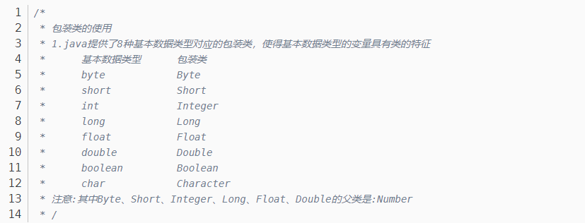

##### 单元测试方法的使用
* java中的junit单元测试
  * 步骤：
    1. 选中当前项目工程 --》 右键:build path --》 add librbraries --》 JUnit 4 --》下一步
    2. 创建一个Java类进行单元测试。
    3. 此时的Java类要求:①此类是公共的 ②此类提供一个公共的无参构造器 ，此类中声明单元测试方法。此时的单元测试方法:方法的权限是public,没有返回值，没有形参。
    4. 此单元测试方法上需要声明注解:@Test并在单元测试类中调用:import org.junit.Test;
    5. 声明好单元测试方法以后，就可以在方法体内测试代码。
    6. 写好代码后，左键双击单元测试方法名：右键 --》 run as --》 JUnit Test

##### 包装类与基本数据类型相互转换
*  图解
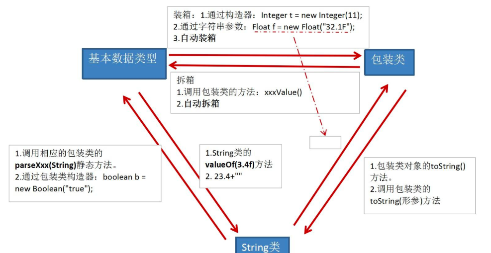

    ```java
    import org.junit.Test;
    /*
    * 2.基本数据类型、包装类、String三者之间的相互转换。
    * 
    */
    public class WrapperTest {
      
      //String类型---> 基本数据类型、包装类,调用包装类的parseXxx()
      @Test
      public void test5(){
        String str1 = "123";
    //		String str1 = "123a";
        
        //错误的情况，可能会报错
    //		int num1 = (int)str1;
    //		Integer in1 = (Integer)str1;
        
        int num2 = Integer.parseInt(str1); 
        System.out.println(num2 + 1);	//124
        
        String str2 = "true";
        Boolean b1 = Boolean.parseBoolean(str2);
        System.out.println(b1);	//true
        
      }
      
      //基本数据类型、包装类---》String类型，调用String重载的valueOf(Xxx xxx)
      @Test
      public void test4(){
        int num1 = 10;
        //方式1:连接运算
        String str1 = num1 + "";
        //方式2:调用String的valueOf(Xxx xxx)
        float f1 = 12.3f;
        String str2 = String.valueOf(f1); //"12.3"
        
        Double d1 = new Double(12.4);
        String str3 = String.valueOf(d1);
        System.out.println(str2);
        System.out.println(str3);	//"12.4"
        
      }
      
      /*
      * JDK 5.0 新特性:自动装箱与自动拆箱
      */
      @Test
      public void test3(){
    //		int num1 = 10;
    //		//基本数据类型 --》 包装类的对象
    //		method(num1);	//Object obj = num1
        
        //自动装箱:基本数据类型 --》 包装类
        int num2 = 10;
        Integer in1 = num2;//自动装箱
        
        boolean b1 = true;
        Boolean b2 = b1;//自动装箱
        
        //自动拆箱：包装类 --》 基本数据类型
        System.out.println(in1.toString());
        
        int num3 = in1;
        
      }
      
      public void method(Object obj){
        System.out.println(obj);
      }
      
      //包装类 --》 基本数据类型:调用包装类的xxxValue()
      @Test
      public void test2() {
        Integer in1 = new Integer(12);
        int i1 = in1.intValue();
        System.out.println(i1 + 1); 
        
        Float f1 = new Float(12.3f);
        float f2 = f1.floatValue();
        System.out.println(f2 + 1); 
      }
      
      //基本数据类型--》包装类,调用包装类的构造器
      @Test
      public void test1() {
        int num1 = 10;
    //		System.out.println(num1.toString());
        
        Integer in1 = new Integer(num1);
        System.out.println(in1.toString());
        
        Integer in2 = new Integer("123");
        System.out.println(in2.toString());
        
        //报异常
    //		Integer in3 = new Integer("123abc");
    //		System.out.println(in3.toString());
        
        Float f1 = new Float(12.3f);
        Float f2 = new Float("12.3");
        System.out.println(f1);
        System.out.println(f2);
        
        Boolean b1 = new Boolean(true);
        Boolean b2 = new Boolean("true");
        
        Boolean b3 = new Boolean("true123");
        System.out.println(b3); //false
        
        Order order = new Order();
        System.out.println(order.isMale); //false
        System.out.println(order.isFemale); //null
        
      }
    }

    class Order{
      
      boolean isMale;
      Boolean isFemale;
    }

    ```
---

# 面向对象（下）

### 关键字static
https://www.php.cn/java/guide/480484.html
当我们编写一个类时，其实就是在描述其对象的属性和行为，而并没有产生实质上的对象，只有通过 new 关键字才会产生出对象，这时系统才会分配内存空间给对象，其方法才可以供外部调用。

我们有时候希望无论是否产生了对象或无论产生了多少对象的情况下，某些特定的数据在内存空间里只有一份。

例如所有的中国人都有个国家名称，每一个中国人都共享这个国家名称，不必在每一个中国人的实例对象中都单独分配一个用于代表国家名称的变量。

* static 关键字的使用
  1.  static:静态的
  2.  static 可以用来修饰:属性、方法、代码块、内部类
  3.  使用static 修饰属性：静态变量（或类变量）。
      1. 1 属性：是否使用 static 修饰，又分为:静态属性 VS 非静态属性(实例变量)
      实例变量:我们创建了类的多个对象，每个对象都独立的拥有了一套类中的非静态属性。
      当修改其中一个非静态属性时，不会导致其他对象中同样的属性值的修饰。
      静态变量:我们创建了类的多个对象，多个对象共享同一个静态变量。当通过静态变量去修改某一个变量时，
      会导致其他对象调用此静态变量时，是修改过的。
      1. 2 static 修饰属性的其他说明:
        ① 静态变量随着类的加载而加载。可以通过"类.静态变量"的方式进行调用。
  			② 静态变量的加载要早于对象的创建。
  			③ 由于类只会加载一次，则静态变量在内存中也只会存在一次。存在方法区的静态域中。
        ④
        |     | 类变量  |  实例变量   |
        |  ----  | ----  | ----  |
        | 类  | yes| no |
        | 对象  | yes | no |

        ```java
        public class StaticTest {
        public static void main(String[] args) {
          
          Chinese.nation = "中国";
          
          Chinese c1 = new Chinese();
          
          //编译不通过
      //		Chinese.name = "张继科";
          
          c1.eat();
          
          Chinese.show();
          //编译不通过
      //		chinese.eat();
      //		Chinese.info();
        }
      }
      //中国人
      class Chinese{
        
        String name;
        int age;
        static String nation;
        
        public void eat(){
          System.out.println("中国人吃中餐");
          //调用非静态结构
          this.info();
          System.out.println("name : " + name);
          //调用静态结构
          walk();
          System.out.println("nation : " + Chinese.nation);
        }
        
        public static void show(){
          System.out.println("我是一个中国人！");
      //		eat();
      //		name = "Tom";
          //可以调用静态的结构
          System.out.println(Chinese.nation);
          walk();
        }
        
        public void info(){
          System.out.println("name : " + name + ",age : " + age);
        }
        
        public static void walk(){
          
        }
      }
        ```

##### 单例设计模式
>设计模式是==在大量的实践中总结和理论化之后优选的代码结构、编程风格、以及解决问题的思考方式==。设计模免去我们自己再思考和摸索。就像是经典的棋谱，不同的棋局，我们用不同的棋谱。==”套路”==
所谓类的单例设计模式，就是采取一定的方法保证在整个的软件系统中，对某个类==只能存在一个对象实例==。并且该类只提供一个取得其对象实例的方法。如果我们要让类在一个虚拟机中只能产生一个对象，我们首先必须将类的==构造器的访问权限设置为 private==，这样，就不能用 new 操作符在类的外部产生类的对象了，但在类内部仍可以产生该类的对象。因为在类的外部开始还无法得到类的对象，只能==调用该类的某个静态方法==以返回类内部创建的对象，静态方法只能访问类中的静态成员变量，所以，指向类内部产生的==该类对象的变量也必须定义成静态的==。
* 特点:
  1. 一个类只能有一个实例；
  2. 自己创建这个实例；
  3. 整个系统都要使用这个实例
* 饿汉模式
  1. 优点：饿汉式线程是安全的
  2. 缺点：对象加载时间过长
* 懒汉式
  1. 优点： 延迟对象的创建
  2. 缺点目前的写法，会线程不安全。---》到多线程内容时，再修改
    ```java
    //单例的饿汉式
    public class SingletonTest {
	  public static void main(String[] args) {
		//Bank bank1 = new Bank(); 
		//Bank bank2 = new Bank(); 
		
		Bank bank1 = Bank.getInstance();
		Bank bank2 = Bank.getInstance();
		
		System.out.println(bank1 == bank2);
		
	  }
    }

    class Bank{
      
      //1.私有化类的构造器
      private Bank(){
        
      }
      
      //2.内部创见类的对象
      //4.要求此对象也必须声明为静态的
      private static Bank instance = new Bank();
      
      //3.提供公共的静态的方法，返回类的对象。
      public static Bank getInstance(){
        return instance;
      }
    ```
* [<font color=red>单例模式的懒汉式实现</font>](practice2/SingletonTest2)
* 应用场景 
  1. win的任务管理器
  2. win的回收站
  3. 网站的计数器

---

### 理解main方法的语法（了解）
由于 Java 虚拟机需要调用类的 ==main()方法==，所以该方法的访问==权限==必须是 ==public==，又因为 Java 虚拟机在执行 main()方法时不必创建对象，所以==该方法必须是 static 的==，该方法接收一个 String 类型的数组参数，该数组中保存执行 Java 命令时传递给所运行的类的参数。

又因为== main() 方法是静态的==，我们不能直接访问该类中的非静态成员，必须创建该类的一个实例对象后，才能通过这个对象去访问类中的非静态成员，这种情况，我们在之前的例子中多次碰到。
* main()方法的使用说明
  1. main()方法作为程序的入口;
  2. main()方法也是一个普通的静态方法
  3. main()方法也可以作为我们与控制台交互的方式。(之前，使用 Scanner)


### 类的成员之四：代码块
  * 作用：用来初始化类、对象的
  * 代码块如果有修饰的话，只能使用 static
  * 分类:静态代码块 vs 非静态代码块

  *  **静态代码块**
     1. 内部可以有输出语句
     2. 随着类的加载而执行,而且只执行一次
     3. 作用:初始化类的信息
     4. 如果一个类中，定义了多个静态代码块，则按照声明的先后顺序执行
     5. 静态代码块的执行，优先于非静态代码块的执行
     6. 静态代码块内只能调用静态的属性、静态的方法，不能调用非静态的结构
  
  * **非静态代码块**
    1. 非静态代码块
    2. 内部可以有输出语句
    3. 随着对象的创建而执行
    4.  每创建一个对象，就执行一次非静态代码块。
    5.  作用:可以在创建对象时，对对象的属性等进行初始化。
    6.  如果一个类中，定义了多个非静态代码块，则按照声明的先后顺序执行
    7.  非静态代码块内可以调用静态的属性、静态的方法，或非静态的属性、非静态的方法。

* **对属性可以复制的位置：**
  1.  默认初始化
  2.  显式初始化
  3.  构造器中初始化
  4.  有了对象以后，可以通过"对象.属性"或"对象.方法"的方式，进行赋值。
  5.  在代码块中赋值
  * 执行的先后顺序:① - ② / ⑤ - ③ - ④
  
  ---

 ### 关键字：final
 *  final:最终的
  1.  final可以用来修饰的结构:类、方法、变量
  2. final用来修饰一个类:此类不能被其他类所继承。
   比如:String类、System类、StringBuffer类
  3. final修饰一个方法:final标记的方法不能被子类重写。
  		  比如：Object类中的getClass()。 
  4. final用来修饰变量:此时的"变量"(成员变量或局部变量)就是一个常量。名称大写，且只能被赋值一次。
     4. 1 final修饰属性，可以考虑赋值的位置有:显式初始化、代码块中初始化、构造器中初始化
      4. 2  final修饰局部变量:
    	 尤其是使用final修饰形参时，表明此形参是一个常量。当我们调用此方法时，给常量形参赋一个实参。
       一旦赋值以后，就只能在方法体内使用此形参，但不能进行重新赋值。
       
  static final 用来修饰:全局常量

* 例：
  ```java
  public class FinalTest {
    
    final int WIDTH = 0;
    final int LEFT;
    final int RIGHT;
  //	final int DOWN;
    
    {
      LEFT = 1;
    }
    
    public FinalTest(){
      RIGHT = 2;
    }
    
    public FinalTest(int n){
      RIGHT = n;
    }
    
  //	public void setDown(int down){
  //		this.DOWN = down;
  //	}
    
    public void dowidth(){
  //		width = 20;	//width cannot be resolved to a variable
    }
    
    public void show(){
      final int NUM = 10;	//常量
  //		num += 20;
    }
    
    public void show(final int num){
      System.out.println(num);
    }
    
    public static void main(String[] args) {
      
      int num = 10;
      
      num = num + 5;
      
      FinalTest test = new FinalTest();
  //		test.setDown(5);
      
      test.show(10);
    }
  }

  final class FianlA{
    
  }

  //class B extends FinalA{     //错误，不能被继承。
  //	
  //}

  //class C extends String{
  //	
  //}

  class AA{
    public final void show(){
      
    }
  }

  //class BB extends AA{	// 错误，不能被重写。
  //	public void show(){
  //		
  //	}
  ```

  ---

### 抽象类与抽象方法
随着继承层次中一个个新子类的定义，类变得越来越具体，而父类则更一般，更通用。类的设计应该保证父类和子类能够共享特征。有时将一个父类设计得非常抽象，以至于它没有具体的实例，这样的类叫做抽象类。
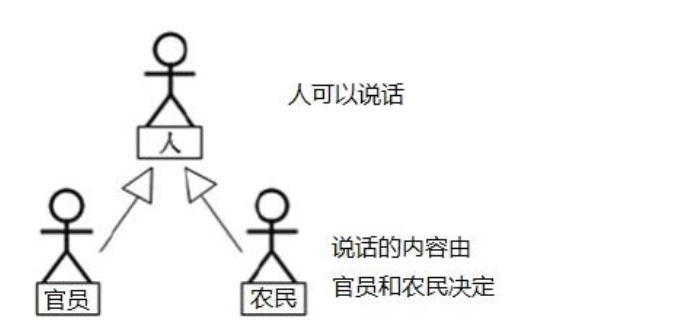

##### abstract 关键字的使用
  * abstract:抽象的
  * abstract 可以用来修饰的结构:类、方法
  * abstract 修饰类:抽象类
    *  此类不能实例化
    *  抽象类中一定有构造器，便于子类实例化时调用(涉及:子类对象实例化全过程)
    *  开发中，都会提供抽象类的子类，让子类对象实例化，实现相关的操作
 * abstract 修饰方法:抽象方法
   * 抽象方法，只有方法的声明，没有方法体。
   * 包含抽象方法的类，一定是一个抽象类。反之，抽象类中可以没有抽象方法
   * 若子类重写了父类中所有的抽象方法，此子类，
   * abstract 使用上的注意点:
     1.  abstract 不能用来修饰变量、代码块、构造器；
     2.  abstract 不能用来修饰私有方法、静态方法、final 的方法、final 的类
    * [<font color=red>案例</font>](practice2/AbstractTest.java)
  * 抽象类与抽象方法的注意事项（https://blog.csdn.net/qq_35427589/article/details/124196068）

##### 抽象类应用
> 抽象类是用来模型化那些父类无法确定全部实现，而是由其子类提供具体实现的对象的类。
> 问题：卡车(Truck)和驳船(RiverBarge)的燃料效率和行驶距离的计算方法完全不同。Vehicle 类不能提供计算方法，但子类可以。
  *  例
    ```java
        /* Java 允许类设计者指定：超类声明一个方法但不提供实现，该方法的实现由子类提  供。这样的方法称为抽象方法。有一个或更多抽象方法的类称为抽象类。
        * Vehicle 是一个抽象类，有两个抽象方法。
        * 注意：抽象类不能实例化 new Vihicle()是非法的
        */
        public abstract class Vehicle{
          public abstract double calcFuelEfficiency();//计算燃料效率的抽象方法
          public abstract double calcTripDistance();//计算行驶距离的抽象方法
        }
        public class Truck extends Vehicle{
          public double calcFuelEfficiency(){ 
            //写出计算卡车的燃料效率的具体方法
          }
          public double calcTripDistance(){ 
            //写出计算卡车行驶距离的具体方法
          }
        }
        public class RiverBarge extends Vehicle{
          public double calcFuelEfficiency() { 
            //写出计算驳船的燃料效率的具体方法
          }
          public double calcTripDistance( )  {  
            //写出计算驳船行驶距离的具体方法
          }
        }
    ```
##### 创建抽象类的匿名子类对象
* 抽象类的匿名子类对象？
  ```java
  public class Num {

  }

  abstract class Creature{
    public abstract void breath();
  }

  abstract class Person extends Creature{
    String name;
    int age;
    
    public Person(){
      
    }
    
    public Person(String name,int age){
      this.name = name;
      this.age = age;
    }
    
    //不是抽象方法
  //	public void eat(){
  //		System.out.println("人吃饭");
  //	}
    
    //抽象方法
    public abstract void eat();
    
    public void walk(){
      System.out.println("人走路");
    }
  }

  class Student extends Person{
    public Student(String name,int age){
      super(name,age);
    }
    public Student(){

    }
    public void eat(){
      System.out.println("学生应该多吃有营养的。");
    }
    @Override
    public void breath() {
      System.out.println("学生应该呼吸新鲜的无雾霾空气");
    }
  }

  ```

* **==测试类==**

  ```java
  /*
  * 抽象类的匿名子类
  * 
  */
  public class PersonTest {
    public static void main(String[] args) {
      
      method(new Student());	//匿名对象
      
      Worker worker = new Worker(); 
      method1(worker);	//非匿名的类非匿名的对象
      
      method1(new Worker());	//非匿名的类匿名的对象
      
      System.out.println("*********************");
      
      //创建了一个匿名子类的对象:p
      Person p = new Person(){

        @Override
        public void eat() {
          System.out.println("吃东西");
        }

        @Override
        public void breath() {
          System.out.println("呼吸空气");
        }
        
      };
      method1(p);
      System.out.println("**********************"); 
      //创建匿名子类的匿名对象
      method1(new Person(){

        @Override
        public void eat() {
          System.out.println("吃零食");
        }

        @Override
        public void breath() {
          System.out.println("云南的空气");
        }
        
      });
    }
    
    public static void method1(Person p){
      p.eat();
      p.walk();
    }
    
    public static void method(Student s){
      
    }
  }
  class Worker extends Person{
    
    @Override
    public void eat() {
    }

    @Override
    public void breath() {
    }
  }

  ```


---

### 接口
##### 概述
一方面，有时必须从几个类中派生出一个子类，继承它们所有的属性和方法。但是，Java 不支持多重继承。有了接口，就可以得到多重继承的效果。

另一方面，有时必须从几个类中抽取出一些共同的行为特征，而它们之间又没有 is-a 的关系，仅仅是具有相同的行为特征而已。例如：鼠标、键盘、打印机、扫描仪、摄像头、充电器、MP3 机、手机、数码相机、移动硬盘等都支持 USB 连接。

接口就是规范，定义的是一组规则，体现了现实世界中“如果你是/要…则必须能…”的思想。继承是一个"是不是"的关系，而接口实现则是"能不能"的关系。

* 接口的使用
  1. 接口使用interface来定义
  2. 在java中：接口和类是并列的两个结构
  3. 如何去定义两个接口：定义接口中的成员
     1. 1 jdk7及以前：只能定义全局常量和抽象方法
     全局常量：public static final 的，书写中，可以省略不写
     抽象方法：public abstract的  
     1. 2 JDK8:除了全局常量和抽象方法之外，还可以定义静态方法、默认方法(略)。
  4. 接口中不能定义构造器！意味着接口不可以实例化。
  5. Java 开发中，接口通过让类去实现(implements)的方式来使用。
    如果实现类覆盖了接口中的所有方法，则此实现类就可以实例化
    如果实现类没有覆盖接口中所有的抽象方法，则此实现类仍为一个抽象类
  6. Java 类可以实现多个接口 ---》弥补了 Java 单继承性的局限性
  格式:class AA extends BB implementd CC,DD,EE
  7. 接口与接口之间是继承,而且可以多继承
  8. 接口的具体使用，体现多态性
 	   接口的主要用途就是被实现类实现。（面向接口编程）
  9. 接口，实际可以看作是一种规范
    ```java
    public class InterfaceTest {
      public static void main(String[] args) {
        System.out.println(Flayable.MAX_SPEED);
        System.out.println(Flayable.MIN_SPEED);
      }
    }
    interface Flayable{
      
      //全局变量
      public static final int MAX_SPEED = 7900;	
      int MIN_SPEED = 1;//省略了 public static final 
      
      //抽象方法
      public abstract void fly();
      
      void stop();//省略了 public abstract 
      //Interfaces cannot have constructors
    //	public Flayable(){
    //		
    //	}	
    }
    interface Attackable{
      void attack();
    }

    class Plane implements Flayable{

      @Override
      public void fly() {
        System.out.println("飞机通过引擎起飞");
        
      }

      @Override
      public void stop() {
        System.out.println("驾驶员减速停止");
      }
      
    }
    abstract class Kite implements Flayable{

      @Override
      public void fly() {
        
      }
    }

    class Bullet extends Object implements Flayable,Attackable,CC{

      @Override
      public void attack() {
        // TODO Auto-generated method stub
        
      }

      @Override
      public void fly() {
        // TODO Auto-generated method stub
        
      }

      @Override
      public void stop() {
        // TODO Auto-generated method stub
        
      }

      @Override
      public void method1() {
        // TODO Auto-generated method stub
        
      }

      @Override
      public void method2() {
        // TODO Auto-generated method stub
        
      }
    }

    //*********************************
    interface AA{
      void method1();
    }
    interface BB{
      void method2();
    }
    interface CC extends AA,BB{
      
    }
    ```
    10. [<font color=red>举例</font>](practice2/USBTest.java)

##### 接口的应用:代理模式(proxy)
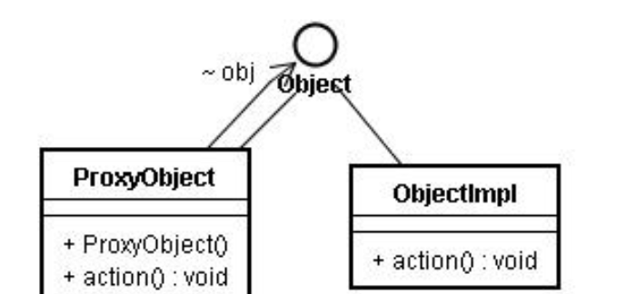


* [<font color=red>代理模式</font>](practice2/NetWorkTest.java)
  * [<font color=red>静态代理</font>](practice2/StaticProxyTest.java)
  * [<font color=red>动态代理</font>]
* 应用场景
  * 安全代理：屏蔽对真实角色的直接访问。
  * 远程代理：通过代理类处理远程方法调用（RMI）
  * 延迟加载：先加载轻量级的代理对象，真正需要再加载真实对象
  
##### 接口的应用：工厂模式


---

### Java8中关于将接口的改进

* [<font color=red>案例</font>](practice2/SubClassTest.java)


### 类的内部成员之五：内部类
当一个事物的内部，还有一个部分需要一个完整的结构进行描述，而这个内部的完整的结构又只为外部事物提供服务，那么整个内部的完整结构最好使用内部类。
1. Java中允许将一个类A声明在另一个类B中,则类A就是内部类,类B就是外部类.

2. 内部类的分类:成员内部类	VS	局部内部类(方法内、代码块内、构造器内)
  2. 1成员内部类
  	  &ensp;&ensp;作为外部类的成员,
  		&ensp;&ensp;调用外部类的结构
  		 &ensp;&ensp;可以被static修饰
  		 &ensp;&ensp;可以被4种不同的权限修饰
  2. 2作为一个类，
   	 &ensp;&ensp;类内可以定义属性、方法、构造器等
   	 &ensp;&ensp;可以被final修饰，表示此类不能被继承。言外之意，不使用final，就可以被继承
   	 &ensp;&ensp;可以abstract修饰
  
3. 关注如下的3个问题
    &ensp;&ensp; 如何实例化成员内部类的对象
   &ensp;&ensp; 如何在成员内部类中区分调用外部类的结构
  &ensp;&ensp;开发中局部内部类的使用  见[<font color=red>《InnerClassTest1.java》</font>](practice2/InnerClassTest1.java)
    ```java
    public class InnerClassTest {
      public static void main(String[] args) {
        
        //创建Dog实例(静态的成员内部类)
        Person.Dog dog = new Person.Dog();
        dog.show();
        
        //创建Bird实例(非静态的成员内部类)
    //		Person.Bird bird = new Person.Bird();
        Person p = new Person();
        Person.Bird bird = p.new Bird();
        bird.sing();
        
        System.out.println();
        
        bird.display("喜鹊");
      }
    }
    class Person{
      String name = "李雷";
      int age;
      
      public void eat(){
        System.out.println("人，吃饭");
      }
      
      //静态成员内部类
      static class Dog{
        String name;
        int age;
        
        public void show(){
          System.out.println("卡拉是条狗");
    //			eat();
        }
      }
      
      //非静态成员内部类
      class Bird{
        String name = "杜鹃";
        public Bird(){
          
        }
        
        public void sing(){
          System.out.println("我是一只猫头鹰");
          Person.this.eat();//调用外部类的非静态属性
          eat();
          System.out.println(age);
        }
        
        public void display(String name){
          System.out.println(name);	//方法的形参
          System.out.println(this.name);	//内部类的属性
          System.out.println(Person.this.name);	//外部类的属性
        }
      }
      public void method(){
        //局部内部类
        class AA{
          
        }
      }
      
      {
        //局部内部类
        class BB{
          
        }
      }
      
      public Person(){
        //局部内部类
        class CC{
          
        }
      }
    }
    ```
#####  匿名内部类
* 详解
  ```java
  /*
  * 1.匿名内部类不能定义任何静态成员、方法和类，只能创建匿名内部类的一个实例。
  * 一个匿名内部类一定是在new的后面，用其隐含实现一个接口或实现一个类。
  * 
  * 2.格式：
  * 		new 父类构造器（实参列表）|实现接口(){
  * 				//匿名内部类的类体部分
  * 		}
  * 
  * 3.匿名内部类的特点
  * 		> 匿名内部类必须继承父类或实现接口
  * 		> 匿名内部类只能有一个对象
  * 		> 匿名内部类对象只能使用多态形式引用
  */
  interface Product{
    public double getPrice();
    public String getName();
  }
  public class AnonymousTest{
    public void test(Product p){
      System.out.println("购买了一个" + p.getName() + "，花掉了" + p.getPrice());
    }
    public static void main(String[] args) {
      AnonymousTest ta = new AnonymousTest();
      //调用test方法时，需要传入一个Product参数，
      //此处传入其匿名实现类的实例
      ta.test(new Product(){
        public double getPrice(){
          return 567.8;
        }
        public String getName(){
          return "AGP显卡";
        }
      });
    }
  }
  ```

##### 局部内部类的使用注意
* 详解
  ```java
  public class InnerClassTest {
    
  //	public void onCreate(){
  //	
  //	int number = 10;
  //	
  //	View.OnClickListern listener = new View.OnClickListener(){
  //		
  //		public void onClick(){
  //			System.out.println("hello!");
  //			System.out.println(number);
  //		}
  //		
  //	}
  //	
  //	button.setOnClickListener(listener);
  //	
  //}

    /*
    * 在局部内部类的方法中(比如:show)如果调用局部内部类所声明的方法(比如：method)中的局部变量(比如：num)的话,
    * 要求此局部变量声明为final的。
    * 
    * jdk 7及之前版本：要求此局部变量显式的声明为final的
    * jdk 8及之后的版本：可以省略final的声明
    * 
    */
    public void method(){
      //局部变量
      int num = 10;
      
      class AA{
        
        public void show(){
  //				num = 20;	//Local variable num defined in an enclosing scope must be final or effectively final
          System.out.println(num);
        }
      }
    }
  }

  ```

  ---

# 异常
在使用计算机语言进行项目开发的过程中，即使程序员把代码写得尽善尽美，在系统的运行过程中仍然会遇到一些问题，因为很多问题不是靠代码能够避免的，比如：客户输入数据的格式，读取文件是否存在，网络是否始终保持通畅等等。
* 理解：
  * 在Java语言中，将程序执行中发生的不正常情况称为“异常”。(开发过程中的语法错误和逻辑错误不是异常)
* 两类：
  * Error：Java虚拟机无法解决的严重问题。如：JVM系统内部错误、资源耗尽等严重情况。比如：StackOverflowError和OOM。一般不编写针对性的代码进行处理。
    ```java
    public class ErrorTest {
      public static void main(String[] args) {
        //1.栈溢出:java.lang.StackOverflowError
    //		main(args);
        //2.堆溢出:java.lang.OutOfMemoryError
    //		Integer[] arr = new Integer[1024*1024*1024];
        
      }
    }
    ```
  * Exception:其它因编程错误或偶然的外在因素导致的一般性问题，可以使用针对性的代码进行处理。
    * 空指针访问
    * 试图读取不存在的文件
    * 网络连接中断
    * 数组角标越界

* 两种解决方法
  * 一是遇到错误就终止程序的运行。
  * 另一种方法是由程序员在编写程序时，就考虑到错误的检测、错误消息的提示，以及错误的处理。

* 异常分类
  * 运行时异常
    * 是指编译器不要求强制处置的异常。一般是指编程时的逻辑错误，是程序员应该积极避免其出现的异常。java.lang.RuntimeException类及它的子类都是运行时异常。
  * 编译时异常
    * 是指编译器要求必须处置的异常。即程序在运行时由于外界因素造成的一般性异常。编译器要求Java程序必须捕获或声明所有编译时异常。

* java异常体系结构
  * java.lang.Throwable
  		|----java.lang.Error:一般不编写针对性的代码进行处理
  		|----java.lang.Exception:可以进行异常处理
  			|----编译时异常(checked)
  				|----IOEXception
  					|----FileNotFoundException
  				|----ClassNotFoundException
  			|----运行时异常(unchecked)
  				|----NullPointerException
  				|----ArrayIndexOutOfBoundsException
  				|----ClassCaseException
  				|----NumberFormatException
  				|----InputMismatchException
  				|----ArithmaticException


    ```java
    public class ExceptionTest {

      // ******************以下是编译时异常***************************
      @Test
      public void test7() {
    //		File file = new File("hello.txt");
    //		FileInputStream fis = new FileInputStream(file);
    //		
    //		int data = fis.read();
    //		while(data != -1){
    //			System.out.print((char)data);
    //			data = fis.read();
    //		}
    //		
    //		fis.close();
      }

      // ******************以下是运行时异常***************************
      // ArithmeticException
      @Test
      public void test6() {
        int a = 10;
        int b = 0;
        System.out.println(a / b);
      }

      // InputMismatchException
      @Test
      public void test5() {
        Scanner scanner = new Scanner(System.in);
        int score = scanner.nextInt();
        System.out.println(score);

        scanner.close();
      }

      // NumberFormatException
      @Test
      public void test4() {
        String str = "123";
        str = "abc";
        int num = Integer.parseInt(str);
      }

      // ClassCaseException
      @Test
      public void test3() {
        Object obj = new Date();
        String str = (String)obj;
      }

      // ArrayIndexOutOfBoundsException
      @Test
      public void test2() {
        // int[] arr = new int[10];
        // System.out.println(arr[10]);

        // String str = "abc";
        // System.out.println(str.charAt(3));
      }

      // NullPointerException
      @Test
      public void test1() {
        // int[] arr = null;
        // System.out.println(arr[3]);

        // String str = "abc";
        // str = null;
        // System.out.println(str.charAt(0));
      }
    }
    ```
### 异常处理机制一：try-catch-findally
* try:捕获异常的第一步是用try{…}语句块选定捕获异常的范围，将可能出现异常的代码放在try语句块中
* catch:在catch语句块中是对异常对象进行处理的代码。每个try语句块可以伴随一个或多个catch语句，用于处理可能产生的不同类型的异常对象。
* 捕获异常的有关信息：与其它对象一样，可以访问一个异常对象的成员变量或调用它的方法。
  * getMessage() 获取异常信息，返回字符串
  * printStackTrace() 获取异常类名和异常信息，以及异常出现在程序中的位置。返回值void
* finally
  * 捕获异常的最后一步是通过finally语句为异常处理提供一个统一的出口，使得在控制流转到程序的其它部分以前，能够对程序的状态作统一的管理。
  * 不论在try代码块中是否发生了异常事件，catch语句是否执行，catch语句是否有异常，catch语句中是否有return，finally块中的语句都会被执行。
  * finally语句和catch语句是任选的
    ```java
    import java.io.File;
    import java.io.FileInputStream;
    import java.io.FileNotFoundException;
    import java.io.IOException;

    import org.junit.Test;

    /*
    * 异常的处理:抓抛模型
    * 
    * 过程一:“抛”：程序在征程执行过程中，一旦出现异常，就会在异常代码处生成一个对应异常类的对象
    * 			 并将此对象抛出。
    * 			一旦抛出对象以后，其后的代码就不再执行。
    * 
    * 过程二:“抓”:可以理解为异常的处理方式：① try-catch-finally  ② throws
    * 
    * 二、try-catch-finally的使用
    * 
    * try{
    * 		//可能出现异常的代码
    * }catch(异常类型1 变量名1){
    * 		//处理异常的方式1
    * }catch(异常类型2 变量名2){
    * 		//处理异常的方式2
    * }catch(异常类型3 变量名3){
    * 		//处理异常的方式3
    * }
    * ...
    * finally{
    * 		//一定会执行的代码
    * }
    * 
    * 说明:
    * 1.finally是可选的。
    * 2.使用try将可能出现异常代码包装起来，在执行过程中，一旦出现异常，就会生成一个对应异常类的对象，根据此对象
    *   的类型，去catch中进行匹配。
    * 3.一旦try中的异常对象匹配到某一个catch时，就进入catch中进行异常的处理。一旦处理完成，就跳出当前的
    *   try-catch结构（在没有写finally的情况）。继续执行其后的代码。
    * 4.catch中的异常类型如果没有子父类关系，则谁声明在上，谁声明在下无所谓。
    *   catch中的异常类型如果满足子父类关系，则要求子类一定声明在父类的上面。否则，报错
    * 5.常用的异常对象处理的方式： ① String  getMessage()    ② printStackTrace()
    * 6.在try结构中声明的变量，再出了try结构以后，就不能再被调用,例65行:System.out.println(num);
    * 7.try-catch-finally结构可以嵌套  
    * 
    * 体会1：使用try-catch-finally处理编译时异常，是得程序在编译时就不再报错，但是运行时仍可能报错。
    *     相当于我们使用try-catch-finally将一个编译时可能出现的异常，延迟到运行时出现。
    *     
    * 体会2：开发中，由于运行时异常比较常见，所以我们通常就不针对运行时异常编写try-catch-finally了。
    *      针对于编译时异常，我们说一定要考虑异常的处理。
    */
    public class ExceptionTest1 {
      
      @Test
      public void test2(){
        try{
          File file = new File("hello.txt");
          FileInputStream fis = new FileInputStream(file);
          
          int data = fis.read();
          while(data != -1){
            System.out.print((char)data);
            data = fis.read();
          }
          
          fis.close();
        }catch(FileNotFoundException e){
          e.printStackTrace();
        }catch(IOException e){
          e.printStackTrace();
        }
      }

      @Test
      public void test1(){
        
        String str = "123";
        str = "abc";
        try{
          int num = Integer.parseInt(str);	
          
          System.out.println("hello-----1");
        }catch(NumberFormatException e){
    //			System.out.println("出现数值转换异常了，不要着急....");
          //String getMessage():
    //			System.out.println(e.getMessage());
          //printStackTrace():
          e.printStackTrace();
        }catch(NullPointerException e){
          System.out.println("出现空指针异常了，不要着急....");
        }catch(Exception e){
          System.out.println("出现异常了，不要着急....");
        }
    //		System.out.println(num);
        
        System.out.println("hello----2");
      }
    }
    ``` 
* finally的使用
  ```java
  import java.io.File;
  import java.io.FileInputStream;
  import java.io.FileNotFoundException;
  import java.io.IOException;

  import org.junit.Test;

  /*
   * try-catch-finally中finally的使用：
   * 
   * 1.finally是可选的。
   * 2.finally中声明的是一定会被执行的代码。即使catch中又出现异常了，try中有return语句，catch中有
   *   return语句等情况。
   * 3.像数据库连接、输入输出流、网络编程Socket等资源，JVM是不能自动的回收的，我们需要自己手动的进行资源的
   *   释放。此时的资源释放，就需要声明在finally中。
   * 
   */
  public class FinallyTest {

  	@Test
  	public void test2() {
  		FileInputStream fis = null;
  		try {
  			File file = new File("hello1.txt");//文件可能不存在，而出现异常
  			fis = new FileInputStream(file);

  			int data = fis.read();
  			while (data != -1) {
  				System.out.print((char) data);
  				data = fis.read();
  			}

  		} catch (FileNotFoundException e) {
  			e.printStackTrace();
  		} catch (IOException e) {
  			e.printStackTrace();
  		} finally {
  			try {
  				if (fis != null)
  					fis.close();
  			} catch (IOException e) {
  				e.printStackTrace();
  			}
  		}
  	}

  	@Test
  	public void testMethod() {
  		int num = method();
  		System.out.println(num);
  	}

  	public int method() {

  		try {
  			int[] arr = new int[10];
  			System.out.println(arr[10]);
  			return 1;
  		} catch (ArrayIndexOutOfBoundsException e) {
  			e.printStackTrace();
  			return 2;
  		} finally {
  			System.out.println("我一定会被执行");
  			return 3;
  		}
  	}

  	@Test
  	public void test1() {
  		try {
  			int a = 10;
  			int b = 0;
  			System.out.println(a / b);
  		} catch (ArithmeticException e) {
  			// e.printStackTrace();

  			int[] arr = new int[10];
  			System.out.println(arr[10]);

  		} catch (Exception e) {
  			e.printStackTrace();
  		}
  		// System.out.println("我好慢呀~~~");
  		finally {
  			System.out.println("我好慢呀~~~");
  		}
  	}
  }
  ```

### 异常处理机制二：throws
* "throws + 异常类型"写在方法的声明处。指明此方法执行时，可能会抛出的异常类型。
  一旦当方法体执行时，出现异常，仍会在异常代码处生成一个异常类的对象，此对象满足throws后异常
  类型时，就会被抛出。异常代码后续的代码，就不再执行！

* 关于异常对象的产生:① 系统自动生成的异常对象
  					② 手动生成一个异常对象，并抛出(throw)

* 体会：try-catch-finally:真正的将异常给处理掉了。
        throws的方式只是将异常抛给了方法的调用者。  并没有真正将异常处理掉。 
  ```java
  public class ExceptionTest2 {
    
    public static void main(String[] args){
      try {
        method2();
      } catch (IOException e) {
        e.printStackTrace();
      }
      
      method3();
    }
    
    public static void method3(){
      try {
        method2();
      } catch (IOException e) {
        e.printStackTrace();
      }
    }
    
    public static void method2() throws IOException{
      method1();
    }

    
    public static void method1() throws FileNotFoundException,IOException{
      File file = new File("hello1.txt");
      FileInputStream fis = new FileInputStream(file);
      
      int data = fis.read();
      while(data != -1){
        System.out.print((char)data);
        data = fis.read();
      }
      
      fis.close();
      
      System.out.println("hahaha!");
    }
  }
  ``` 
* [<font color=red>重写方法声明抛出异常的原则</font>](practice2/OverrideTest.java)


### 手动抛出异常
* Java异常类对象除在程序执行过程中出现异常时由系统自动生成并抛出，也可根据需要使用人工创建并抛出。
  ```java
  public class StudentTest {
	public static void main(String[] args) {
      try {
        Student s = new Student();
  //		s.regist(1001);
        s.regist(-1001);
        System.out.println(s);
      } catch (Exception e) {
  //			e.printStackTrace();
        System.out.println(e.getMessage());
      }
    }
  }
  class Student{
    private int id;
    
    public void regist(int id) throws Exception{
      if(id > 0){
        this.id = id;
      }else{
  //			System.out.println("您输入的数据非法！");
        //手动抛出异常
  //			throw new RuntimeException("您输入的数据非法！");
        throw new Exception("您输入的数据非法！");
        
      }
    }

    @Override
    public String toString() {
      return "Student [id=" + id + "]";
    }
    
  }
  ``` 

### 用户自定义异常类
* 一般地，用户自定义异常类都是RuntimeException的子类。
*  自定义异常类通常需要编写几个重载的构造器。
* 自定义异常需要提供serialVersionUID
* 自定义的异常通过throw抛出。
* 自定义异常最重要的是异常类的名字，当异常出现时，可以根据名字判断异常类型
  ```java
  /*
  * 如何自定义异常类？
  * 1.继承于现有的异常结构：RuntimeException 、Exception
  * 2.提供全局常量：serialVersionUID
  * 3.提供重载的构造器
  * 
  */
  public class MyException extends RuntimeException{
    static final long serialVersionUID = -7034897193246939L;
    
    public MyException(){
      
    }
    
    public MyException(String msg){
      super(msg);
    }
  }

  ```
  **练习**
  ```java
    /*
  * 编写应用程序EcmDef.java，接收命令行的两个参数，
  * 		要求不能输入负数，计算两数相除。
  * 		对 数 据 类 型 不 一 致(NumberFormatException)、
  * 		缺 少 命 令 行 参 数(ArrayIndexOutOfBoundsException、
  * 		除0(ArithmeticException)及输入负数(EcDef自定义的异常)进行异常处理。
  *
  * 提示：
  * 		(1)在主类(EcmDef)中定义异常方法(ecm)完成两数相除功能。
  * 		(2)在main()方法中使用异常处理语句进行异常处理。
  * 		(3)在程序中，自定义对应输入负数的异常类(EcDef)。
  * 		(4)运行时接受参数java EcmDef2010//args[0]=“20”args[1]=“10”
  * 		(5)Interger类的static方法parseInt(Strings)将s转换成对应的int值。
  * 		如：int a=Interger.parseInt(“314”);//a=314;
  */
  public class EcmDef {
    public static void main(String[] args) {
      try {
        int i = Integer.parseInt(args[0]);
        int j = Integer.parseInt(args[0]);
        
        int result = ecm(i,j);
        
        System.out.println(result);
      } catch (NumberFormatException e) {
        System.out.println("数据类型不一致");
      }catch (ArrayIndexOutOfBoundsException e){
        System.out.println("缺少命令行参数");
      }catch (ArithmeticException e){
        System.out.println("除0");
      }catch (EcDef e) {
        System.out.println(e.getMessage());
      }
    }
    
    public static int ecm(int i, int j) throws EcDef{
      if(i < 0 || j < 0){
        throw new EcDef("分子或分母为负数了！");
      }
      return i / j;
    }
  }
  ```
  ```java
    //自定义异常类
  public class EcDef extends Exception {

    static final long serialVersionUID = -33875164229948L;

    public EcDef() {
      
    }

    public EcDef(String msg) {
      super(msg);
    }
  }

  ```

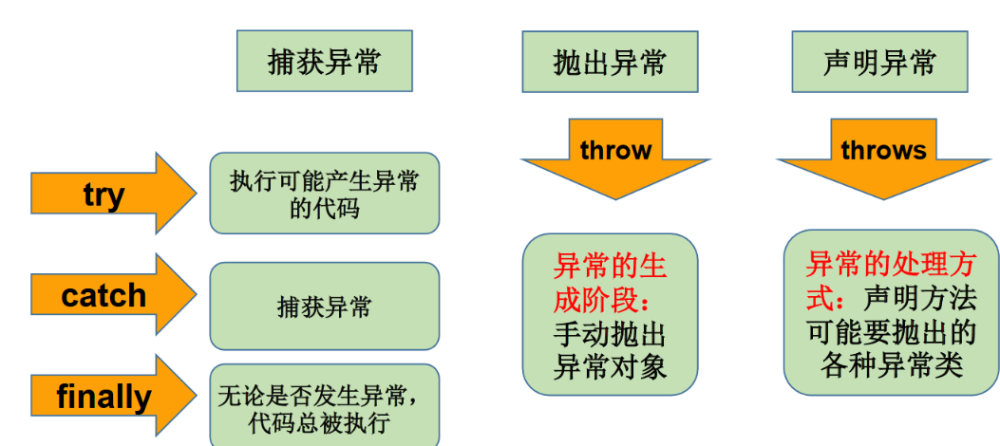


---

# 多线程
### 基本概念：程序、进程、线程
* 程序：为完成特定任务、用某种语言编写的一组指令的集合。即指一段静态的代码，静态对象。
* 进程：程序的一次执行过程，或是正在运行的一个程序。是一个动态的过程：有它自身的产生、存在和消亡的过程。——生命周期 
* 线程：进程可进一步细化为线程，是一个程序内部的一条执行路径。 

##### 进程与线程
* 单核CPU：其实是一种假的多线程，因为在一个时间单元内，也只能执行一个线程的任务。但是因为CPU时间单元特别短，因此感觉不出来。
* 一个Java应用程序java.exe，其实至少有三个线程：main()主线程，gc()垃圾回收线程，异常处理线程。当然如果发生异常，会影响主线程。
* 如果是多核的话，才能更好的发挥多线程的效率。（现在的服务器都是多核的）
* 并行：多个CPU同时执行多个任务。比如：多个人0同时做不同的事。
* 并发：一个CPU(采用时间片)同时执行多个任务。比如：秒杀、多个人做同一件事。
  
##### 多线程的优点
 1.  提高应用程序的响应。对图形化界面更有意义，可增强用户体验。
 2.  提高计算机系统CPU的利用率
 3.  改善程序结构。将既长又复杂的进程分为多个线程，独立运行，利于理解和修改
##### 何时需要多线程
1. 程序需要同时执行两个或多个任务。
2. 程序需要实现一些需要等待的任务时，如用户输入、文件读写操作、网络操作、搜索等。
3. 需要一些后台运行的程序时。

### 线程的创建和使用

##### 线程的创建和启动
* Java语言的JVM允许程序运行多个线程，它通过java.lang.Thread类来体现。
* Thread类的特性
  * 每个线程都是通过某个特定Thread对象的run()方法来完成操作的，经常把run()方法的主体称为线程体
  * 通过该Thread对象的start()方法来启动这个线程，而非直接调用run()
* Thread 类
  * $\color{cyan}{Thread()}$:创建新的Thread对象
  * $\color{cyan}{Thread(String threadname)}$:创建线程并指定线程实例名
  * $\color{cyan}{Runnabletarget}$:指定创建线程的目标对象，它实现了Runnable接口中的run方法
  * $\color{cyan}{Thread(Runnable target,String name)}$:创建新的Thread对象
* API中创建线程的两种方式
  * 继承Thread类的方式
    * [<font color=red>《创建多线程的方式一：继承Thread类》</font>](Threadpractice3/ThreadTest.java) 
    * [<font color=red>练习:创建两个分线程，其中一个遍历100以内的偶数，另一个遍历100以内的奇数</font>](Threadpractice3/ThreadDemo.java)
    * [<font color=red>Thread类的有关方法</font>](Threadpractice3/ThreadModeTest.java)
      * $\color{cyan}{start()}$:启动当前线程，执行当前线程的run()
      * $\color{cyan}{run()}$:通常需要重写Thread类中的此方法，将创建的线程要执行的操作声明在此方法中
      * $\color{cyan}{currentThread()}$:静态方法，返回当前代码执行的线程
      * $\color{cyan}{getName()}$:获取当前线程的名字
      * $\color{cyan}{setName()}$:设置当前线程的名字
      * $\color{cyan}{yield()}$:释放当前CPU的执行权
      * $\color{cyan}{join()}$:在线程a中调用线程b的join(),此时线程a就进入阻塞状态，直到线程b完全执行完以后，线程a才结束阻塞状态
      * $\color{cyan}{stop()}$:已过时。当执行此方法时，强制结束当前线程。
      * $\color{cyan}{sellp(long millitime)}$:让当前线程“睡眠”指定时间的millitime毫秒)。在指定的millitime毫秒时间内，当前线程是阻塞状态的。
      * $\color{cyan}{isAlive()}$:返回boolean，判断线程是否还活着
    * 线程的调度
      * 抢占式：高优先级的线程抢占CPU
      * 同优先级线程组成先进先出队列（先到先服务），使用时间片策略
      * 对高优先级，使用优先调度的抢占式策略
    * 线程的优先级
      * $\color{cyan}{MAX_PRIORITY: 10}$
      * $\color{cyan}{MIN_PRIORITY: 1}$
      * $\color{cyan}{NORM_PRIORITY: 5}$
    * 涉及的方法 
      * $\color{cyan}{getPriority()}$:返回线程优先值
      * $\color{cyan}{setPriority(intnewPriority)}$:改变线程的优先级
      * ==注：==高优先级的线程要抢占低优先级线程cpu的执行权。
        但是只是从概率上讲，高优先级的线程高概率的情况下被执行。
        并不意味着只有当高优先级的线程执行完以后，低优先级的线程才会被执行
   
    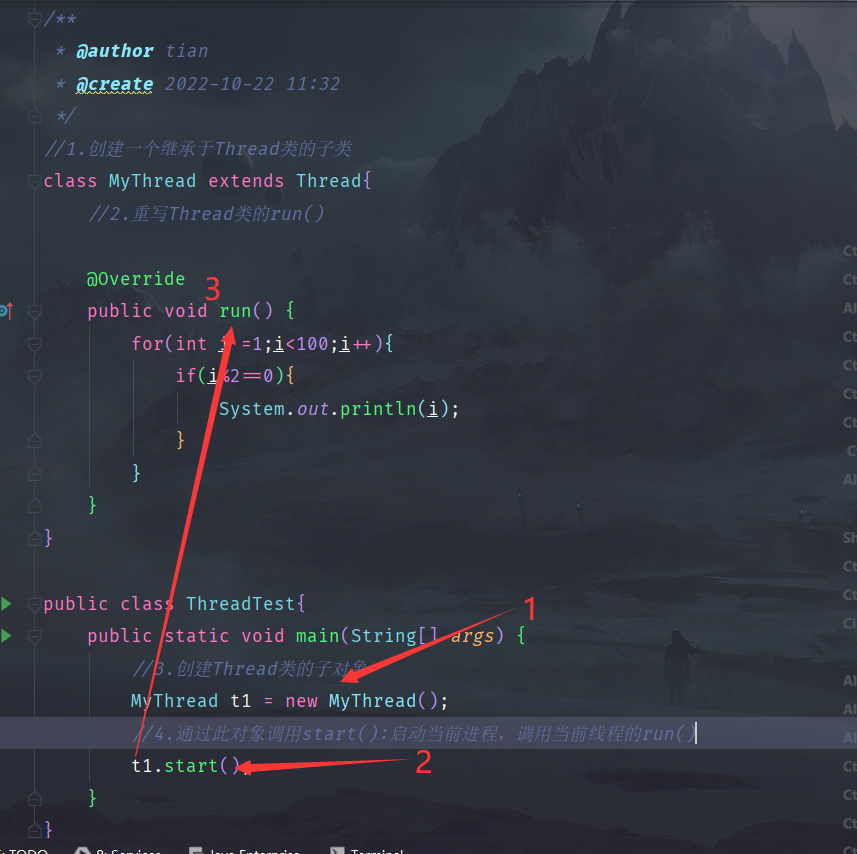
    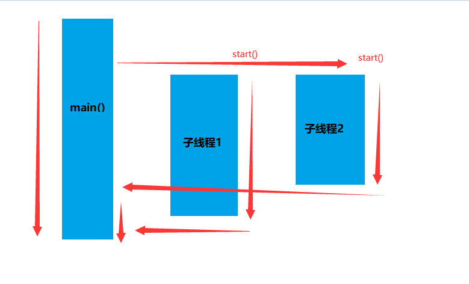
  * [<font color=red>实现Runnable接口的方式</font>](Threadpractice3/ThreadTest1.java)
    * 1.创建一个实现了Runnable接口得类
    * 2.实现类去实现Runnable中的抽象方法:run()
    * 3.创建实现类的对象
    * 4.将此对象作为参数传递到Thread类的构造器中，创建Thread类的对象
    * 5.通过Thread类的对象调用start()
  * 继承方式和实现方式的联系与区别
    * 开发中：优先选择：实现Runnable接口的方式
      *  原因：1. 实现的方式没有类的单继承性的局限性
      2.实现的方式更适合来处理多个线程有共享数据的情况。
    * 相同点：两种方式都需要重写run(),将线程要执行的逻辑声明在run()中。
  * 补充：线程的分类
    >  ava中的线程分为两类：一种是守护线程，一种是用户线程。
    它们在几乎每个方面都是相同的，唯一的区别是判断JVM何时离开。
守护线程是用来服务用户线程的，通过在start()方法前调用**thread.setDaemon(true)**可以把一个用户线程变成一个守护线程。
Java垃圾回收就是一个典型的守护线程。
若JVM中都是守护线程，当前JVM将退出。
形象理解：兔死狗烹，鸟尽弓藏

### 线程的生命周期
* 新建：当一个Thread类或其子类的对象被声明并创建时，新生的线程对象处于新建状态
* 就绪：处于新建状态的线程被start()后，将进入线程队列等待CPU时间片，此时它已具备了运行的条件，只是没分配到CPU资源
* 运行：当就绪的线程被调度并获得CPU资源时,便进入运行状态，run()方法定义了线程的操作和功能
* 阻塞：在某种特殊情况下，被人为挂起或执行输入输出操作时，让出CPU并临时中止自己的执行，进入阻塞状态
* 死亡：线程完成了它的全部工作或线程被提前强制性地中止或出现异常导致结束

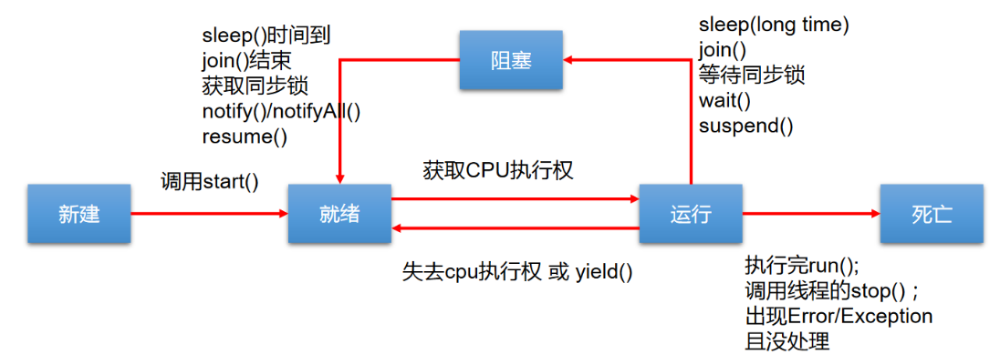

* 线程的同步
  * 多个线程执行操作造成结果的不确定性

### 同步代码块处理实现Runnable的线程安全问题
* 方式一：同步代码块
 synchronized(同步监视器){
       //需要被同步的代码
 
   }
* 方式二：同步方法
              如果操作共享数据的代码完整的声明在一个方法中，我们不妨将此方法声明同步的

* 优点:解决了线程的安全问题
* 缺点:操作同步代码时，只能有一个线程参与，其他线程等待。相当于是一个单线程的过程，效率低
  ```java
  /**
   *  例子：创建三个窗口卖票，总票数为100张.使用实现Runnable接口的方式
  *  1.卖票过程中出现重票、错票 ---》出现了线程的安全问题
  *  2.问题出现的原因:当某个线程操作车票的过程中，尚未操作完成时，其他线程参与进来，也操作车票
  *  3.如何解决：当一个线程在操作ticket的时候，其他线程不能参与进来。直到线程a操作完ticket时，其他
  *            线程才可以操作ticket。这种情况即使线程a出现了阻塞，也不能被改变。
  *  4.在java中，我们通过同步机制，来解决线程的安全问题。
  *
  *  方式一：同步代码块
  *  synchronized(同步监视器){
  *      //需要被同步的代码
  *
  *  }
  *  说明：1.操作共享数据的代码，即为需要被同步的代码 --->不能包含代码多了，也不能包含代码少了。
  *       2.共享数据：多个线程共同操作的变量。比如：ticket就是共享数据
  *       3.同步监视器，俗称：锁。任何一个类的对象，都可以来充当锁。
  *          要求：多个线程必须要共用同一把锁。
  *
  *       补充：在实现Runnable接口创建多线程的方式中，我们可以考虑使用this充当同步监视器。
  *
  *  方式二：同步方法
  *      如果操作共享数据的代码完整的声明在一个方法中，我们不妨将此方法声明同步的
  *
  *  5.同步的方式，解决了线程的安全问题。---好处
  *    操作同步代码时，只能有一个线程参与，其他线程等待。相当于是一个单线程的过程，效率低。---局限性
  */

  class Windows1 implements Runnable{

      private int ticket = 100;
  //    Object obj = new Object();
  //    Dog dog = new Dog();

      @Override
      public void run() {
          while(true){
              synchronized (this) {//此时的this:唯一的windows1的对象 //方式二:synchronized (dog) {
                  if (ticket > 0) {

                      try{
                          Thread.sleep(100);
                      }catch (InterruptedException e){
                          e.printStackTrace();
                      }

                      System.out.println(Thread.currentThread().getName() + ":卖票，票号为: " + ticket);
                      ticket--;
                  } else {
                      break;
                  }
              }
          }
      }
  }

  public class WindowsTest1 {
      public static void main(String[] args) {
          Windows1 w = new Windows1();

          Thread t1 = new Thread(w);
          Thread t2 = new Thread(w);
          Thread t3 = new Thread(w);

          t1.setName("窗口1");
          t2.setName("窗口2");
          t3.setName("窗口3");

          t1.start();
          t2.start();
          t3.start();
      }
  }
  class Dog{

  }
  ```
### 同步代码块处理继承Thread类的线程安全问题
* 详情见代码   

  ```java
  /**
   * 使用同步代码块解决继承Thread类的方式的线程安全问题
   *
   * 例子：创建三个c窗口卖票，总票数为100张
   */
  class Windows extends Thread{

      private static int ticket = 100;
      private static Object obj = new Object();

      @Override
      public void run() {
          while(true){
              //正确的
  //            synchronized (obj) {
              synchronized (Windows.class){   //Class clazz = Windows.class
              //错误的，因为此时this表示的是t1,t2,t3三个对象
  //            synchronized (this) {
                  if (ticket > 0) {

                      try {
                          Thread.sleep(100);
                      } catch (InterruptedException e) {
                          e.printStackTrace();
                      }

                      System.out.println(getName() + ":卖票，票号为: " + ticket);
                      ticket--;
                  } else {
                      break;
                  }
              }
          }
      }
  }

  public class WindowsTest2 {
      public static void main(String[] args) {
          Windows t1 = new Windows();
          Windows t2 = new Windows();
          Windows t3 = new Windows();

          t1.setName("窗口1");
          t2.setName("窗口2");
          t3.setName("窗口3");

          t1.start();
          t2.start();
          t3.start();
      }
  }
  ```
### 同步方法处理实现Runnable的线程安全问题
* 详情见代码
  ```java
  /**
   * 使用同步方法解决实现Runnable接口的线程安全问题
   *
   * 关于同步方法的总结:
   *  1. 同步方法仍然涉及到同步监视器，只是不需要我们显式的声明。
   *  2. 非静态的同步方法，同步监视器是：this
   *     静态的同步方法，同步监视器是：当前类本身
   */

  class Windows3 implements Runnable {

      private int ticket = 100;

      @Override
      public void run() {
          while (true) {
              show();
          }
      }

      public synchronized void show() { //同步监视器:this
  //        synchronized (this){
              if (ticket > 0) {
                  try {
                      Thread.sleep(100);
                  } catch (InterruptedException e) {
                      e.printStackTrace();
                  }
                  System.out.println(Thread.currentThread().getName() + ":卖票，票号为: " + ticket);
                  ticket--;
              }
  //        }
      }
  }

  public class WindowsTest3 {
      public static void main(String[] args) {
          Windows3 w3 = new Windows3();

          Thread t1 = new Thread(w3);
          Thread t2 = new Thread(w3);
          Thread t3 = new Thread(w3);

          t1.setName("窗口1");
          t2.setName("窗口2");
          t3.setName("窗口3");

          t1.start();
          t2.start();
          t3.start();
      }
  }
  ```


# 常用类 
### String类的概述

* String的使用
  1. String:字符串，使用一对“”引起来表示。
  2.  String声明为final的，不可被继承
  3.  String实现了Serializable接口：表示字符串是支持序列化的。  实现了Comparable接口：表示String可以比较大小
  4.  String内部定义了final char[] value用于存储字符串数据
  5.  String:代表不可变的字符序列。简称：不可变性。
      1.  当对字符串重新赋值时，需要重写指定内存区域赋值，不能使用原有的value进行赋值。
      2. 当对现有的字符串进行连接操作时，也需要重新指定内存区域赋值，不能使用原有的value进行赋值。
      3. 当调用String的replace()方法修改指定字符或字符串时，也需要重新指定内存区域赋值，不能使用原有的value进行赋值。
  6. 通过字面量的方式（区别于new）给一个字符串赋值，此时的字符串值声明在字符串常量池中。
  7. 字符串常量池中是不会存储相同内容的字符串的。
    ```java
     public void Test1(){
            String s1 = "abc";  //字面量的定义方式
            String s2 = "abc";
            s1 = "hello";

            System.out.println(s1 == s2);//比较s1和s2的地址值

            System.out.println(s1);//hello
            System.out.println(s2);//abc

            System.out.println("*********************");

            String s3 = "abc";
            s3 += "def";
            System.out.println(s3);//abcdef

            System.out.println("**********************");

            String s4 = "abc";
            String s5 = s4.replace('a', 'm');
            System.out.println(s4);//abc
            System.out.println(s5);//mbc
        }
    }
    ```
  

### String不同实例化方式的对比1
1. String对象的创建
   ```java
   String str = "hello";

    //本质上this.value = new char[0];
    String  s1 = new String(); 

    //this.value = original.value;
    String  s2 = new String(String original); 

    //this.value = Arrays.copyOf(value, value.length);
    String  s3 = new String(char[] a);

    String  s4 = new String(char[] a,int startIndex,int count);
   ```
   

### [<font color=red>String不同拼接操作的对比</font>](Stringpractice4/StringTest.java)
* String 使用陷阱
  ```java
  String s1 = “a”; //1.说明：在字符串常量池中创建了一个字面量为"a"的字符串。
  
  s1 = s1 + “b”; //2.说明：实际上原来的“a”字符串对象已经丢弃了，现在在堆空间中产生了一个字符串s1+“b”（也就是"ab")。如果多次执行这些改变串内容的操作，会导致大量副本字符串对象存留在内存中，降低效率。如果这样的操作放到循环中，会极大影响程序的性能。

  String s2 = “ab”;//说明：直接在字符串常量池中创建一个字面量为"ab"的字符串。
  
  String s3 = “a” + “b”; //说明：s3指向字符串常量池中已经创建的"ab"的字符串。

  String s4 = s1.intern();  //说明：堆空间的s1对象在调用intern()之后，会将常量池中已经存在的"ab"字符串赋值给s4

  ```


# 枚举类和注解的使用
### 枚举类的理解
* 类的对象只有有限个，确定的。举例如下：
  * 星期：Monday(星期一)、…、Sunday(星期天)
  * 性别：Man(男)、Woman(女)
  * 季节：Spring(春节)…Winter(冬天)
  * 支付方式：Cash（现金）、WeChatPay（微信）、Alipay(支付宝)、BankCard(银行卡)、CreditCard(信用卡)
  * 就职状态：Busy、Free、Vocation、Dimission
  * 订单状态：Nonpayment（未付款）、Paid（已付款）、Delivered（已发货）、Return（退货）、Checked（已确认）Fulfilled（已配货）、
  * 线程状态：创建、就绪、运行、阻塞、死亡

* 当需要定义一组常量时，强烈建议使用枚举类
* 枚举类的实现：
  * JDK1.5之前需要自定义枚举类
  * JDK 1.5 新增的enum 关键字用于定义枚举类
* 若枚举只有一个对象, 则可以作为一种单例模式的实现方式。

### 自定义枚举类
* 枚举类的属性：
  * 枚举类对象的属性不应允许被改动, 所以应该使用private final修饰
  * 枚举类的使用private final 修饰的属性应该在构造器中为其赋值
  * 若枚举类显式的定义了带参数的构造器, 则在列出枚举值时也必须对应的传入参数
    ```java
    public class SeasonTest {
        public static void main(String[] args) {
            Season spring = Season.SPRING;
            System.out.println(spring);
        }
    }
    //自定义枚举类
    class Season{
        //1.声明Season对象的属性:private final修饰
        private final String seasonName;
        private final String seasonDesc;

        //2.私有化类的构造器,并给对象属性赋值
        private Season(String seasonName,String seasonDesc){
            this.seasonName = seasonName;
            this.seasonDesc = seasonDesc;
        }

        //3.提供当前枚举类的多个对象
        public static final Season SPRING = new Season("春天","万物复苏");
        public static final Season SUMMER = new Season("夏天","烈日炎炎");
        public static final Season AUTUMN = new Season("秋天","金秋送爽");
        public static final Season WINTER = new Season("冬天","白雪皑皑");

        //4.其他诉求：获取枚举类对象的属性
        public String getSeasonName() {
            return seasonName;
        }

        public String getSeasonDesc() {
            return seasonDesc;
        }

        //4.其他诉求1：提供toString()
        @Override
        public String toString() {
            return "Season{" +
                    "seasonName='" + seasonName + '\'' +
                    ", seasonDesc='" + seasonDesc + '\'' +
                    '}';
        }
    }
    ```
### 使用enum关键字定义枚举类
* 使用说明
  * 使用enum定义的枚举类默认继承了java.lang.Enum类，因此不能再继承其他类
  * 枚举类的构造器只能使用private 权限修饰符
  * 枚举类的所有实例必须在枚举类中显式列出(, 分隔; 结尾)。列出的实例系统会自动添加public static final 修饰
  * 必须在枚举类的第一行声明枚举类对象
    ```java
    /**
     * 使用enum关键字定义枚举类
     * 说明：定义的枚举类默认继承于java.lang.Enum类
     */
    public class SeasonTest1 {
        public static void main(String[] args) {
            Season1 summer = Season1.SUMMER;
            //toString():
            System.out.println(summer.toString());
            
            System.out.println(Season1.class.getSuperclass());
        }
    }

    //使用enum关键字枚举类
    enum Season1{
        //1.提供当前枚举类的对象，多个对象之间用","隔开，末尾对象";"结束
        SPRING("春天","万物复苏"),
        SUMMER("夏天","烈日炎炎"),
        AUTUMN("秋天","金秋送爽"),
        WINTER("冬天","白雪皑皑");

        //2.声明Season对象的属性:private final修饰
        private final String seasonName;
        private final String seasonDesc;

        //3.私有化类的构造器,并给对象属性赋值
        private Season1(String seasonName,String seasonDesc){
            this.seasonName = seasonName;
            this.seasonDesc = seasonDesc;
        }

        //4.其他诉求：获取枚举类对象的属性
        public String getSeasonName() {
            return seasonName;
        }

        public String getSeasonDesc() {
            return seasonDesc;
        }

        //4.其他诉求1：提供toString()
    //    @Override
    //    public String toString() {
    //        return "Season{" +
    //                "seasonName='" + seasonName + '\'' +
    //                ", seasonDesc='" + seasonDesc + '\'' +
    //                '}';
    //    }
    }
    ``` 

### eunum类中的常用方法

* enum类的主要方法
  * $\color{cyan}{values()}$:返回枚举类型的对象数组。该方法可以很方便地遍历所有的枚举值。
  * $\color{cyan}{valueOf(String str)}$:可以把一个字符串转为对应的枚举类对象。要求字符串必须是枚举类对象的“名字”。如不是，会有运行时异常：IllegalArgumentException。
  * $\color{cyan}{toString()}$:返回当前枚举类对象常量的名称
    ```java
    public class SeasonTest1 {
    public static void main(String[] args) {
            Season1 summer = Season1.SUMMER;
            //toString():
            System.out.println(summer.toString());

    //        System.out.println(Season1.class.getSuperclass());
            System.out.println("**************************");
            //values():返回所有的枚举类对象构成的数组
            Season1[] values = Season1.values();
            for(int i = 0;i < values.length;i++){
                System.out.println(values[i]);
            }
            System.out.println("****************************");
            Thread.State[] values1 = Thread.State.values();
            for(int i = 0;i < values1.length;i++){
                System.out.println(values1[i]);
            }

            //valueOf(String objName):返回枚举类中对象名是objName的对象。
            Season1 winter = Season1.valueOf("WINTER");
            //如果没有objName的枚举类对象，则抛异常：IllegalArgumentException
    //        Season1 winter = Season1.valueOf("WINTER1");
            System.out.println(winter);

        }
    }

    //使用enum关键字枚举类
    enum Season1{
        //1.提供当前枚举类的对象，多个对象之间用","隔开，末尾对象";"结束
        SPRING("春天","万物复苏"),
        SUMMER("夏天","烈日炎炎"),
        AUTUMN("秋天","金秋送爽"),
        WINTER("冬天","白雪皑皑");

        //2.声明Season对象的属性:private final修饰
        private final String seasonName;
        private final String seasonDesc;

        //3.私有化类的构造器,并给对象属性赋值
        private Season1(String seasonName,String seasonDesc){
            this.seasonName = seasonName;
            this.seasonDesc = seasonDesc;
        }

        //4.其他诉求：获取枚举类对象的属性
        public String getSeasonName() {
            return seasonName;
        }

        public String getSeasonDesc() {
            return seasonDesc;
        }

        //4.其他诉求1：提供toString()
    //    @Override
    //    public String toString() {
    //        return "Season{" +
    //                "seasonName='" + seasonName + '\'' +
    //                ", seasonDesc='" + seasonDesc + '\'' +
    //                '}';
    //    }
    }
    ```
### 使用enum关键字定义的枚举类实现接口
* 情况一：实现接口，在enum类中实现抽象方法
* 情况二：让枚举类的对象分别实现接口中的抽象方法
    ```java 
    public class SeasonTest1 {
        public static void main(String[] args) {
            //values():返回所有的枚举类对象构成的数组
            Season1[] values = Season1.values();
            for(int i = 0;i < values.length;i++){
                System.out.println(values[i]);
                values[i].show();
            }

            //valueOf(String objName):返回枚举类中对象名是objName的对象。
            Season1 winter = Season1.valueOf("WINTER");
            winter.show();
        }
    }

    interface Info{
        void show();
    }

    //使用enum关键字枚举类
    enum Season1 implements Info{
        //1.提供当前枚举类的对象，多个对象之间用","隔开，末尾对象";"结束
        SPRING("春天","春暖花开"){
            @Override
            public void show() {
                System.out.println("一元复始、万物复苏");
            }
        },
        SUMMER("夏天","夏日炎炎"){
            @Override
            public void show() {
                System.out.println("蝉声阵阵、烈日当空");
            }
        },
        AUTUMN("秋天","秋高气爽"){
            @Override
            public void show() {
                System.out.println("天高气清、金桂飘香");
            }
        },
        WINTER("冬天","冰天雪地"){
            @Override
            public void show() {
                System.out.println("寒冬腊月、滴水成冰");
            }
        };

        //2.声明Season对象的属性:private final修饰
        private final String seasonName;
        private final String seasonDesc;

        //3.私有化类的构造器,并给对象属性赋值
        private Season1(String seasonName,String seasonDesc){
            this.seasonName = seasonName;
            this.seasonDesc = seasonDesc;
        }

        //4.其他诉求：获取枚举类对象的属性
        public String getSeasonName() {
            return seasonName;
        }

        public String getSeasonDesc() {
            return seasonDesc;
        }

        //4.其他诉求1：提供toString()
    //    @Override
    //    public String toString() {
    //        return "Season{" +
    //                "seasonName='" + seasonName + '\'' +
    //                ", seasonDesc='" + seasonDesc + '\'' +
    //                '}';
    //    }

    //    @Override
    //    public void show() {
    //        System.out.println("这是一个季节。");
    //    }
    }
    ```
### 注解的理解
&ensp;&ensp;&ensp;从JDK 5.0 开始, Java 增加了对元数据(MetaData) 的支持, 也就是Annotation(注解)
&ensp;&ensp;&ensp;Annotation 其实就是代码里的特殊标记, 这些标记可以在编译, 类加载, 运行时被读取, 并执行相应的处理。通过使用Annotation, 程序员可以在不改变原有逻辑的情况下, 在源文件中嵌入一些补充信息。代码分析工具、开发工具和部署工具可以通过这些补充信息进行验证或者进行部署。
&ensp;&ensp;&ensp;Annotation 可以像修饰符一样被使用, 可用于修饰包,类, 构造器, 方法, 成员变量, 参数, 局部变量的声明, 这些信息被保存在Annotation 的“name=value” 对中。
&ensp;&ensp;&ensp;在JavaSE中，注解的使用目的比较简单，例如标记过时的功能，忽略警告等。在JavaEE/Android中注解占据了更重要的角色，例如用来配置应用程序的任何切面，代替JavaEE旧版中所遗留的繁冗代码和XML配置等。
&ensp;&ensp;&ensp;未来的开发模式都是基于注解的，JPA是基于注解的，Spring2.5以上都是基于注解的，Hibernate3.x以后也是基于注解的，现在的Struts2有一部分也是基于注解的了，注解是一种趋势，一定程度上可以说：框架= 注解+ 反射+ 设计模式。
### Annotaton的使用示例
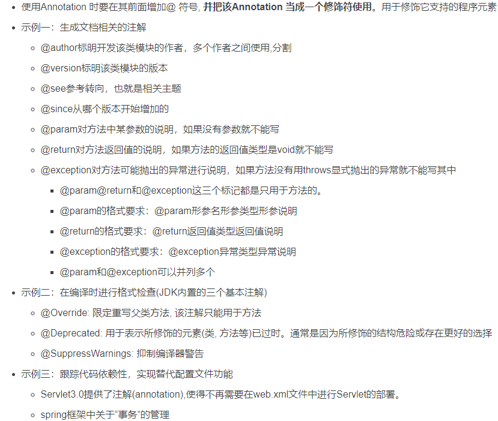
* ① jdk 5.0 新增的功能
* Annotation 其实就是代码里的特殊标记, 这些标记可以在编译, 类加载, 运行时被读取, 并执行相应的处理。通过使用 Annotation,
     程序员可以在不改变原有逻辑的情况下, 在源文件中嵌入一些补充信息。
* ③在JavaSE中，注解的使用目的比较简单，例如标记过时的功能，忽略警告等。在JavaEE/Android
### 如何自定义注解
* 定义新的Annotation类型使用**@interface**关键字
* 自定义注解自动继承了**java.lang.annotation.Annotation**接口
* 如果只有一个参数成员，建议使用参数名为value
* 如果定义的注解含有配置参数，那么使用时必须指定参数值，除非它有默认值。格式是“参数名=参数值”，如果只有一个参数成员，且名称为value，可以省略“value=”
* 没有成员定义的Annotation称为标记;包含成员变量的Annotation称为元数据Annotation
  ```java
  public @interface MyAnnotation {

      String value();
  }
  /**
  * 注解的使用
  *
  *  3.如何自定义注解：参照@SuppressWarnings定义
  *      ① 注解声明为：@interface
  *      ② 内部定义成员，通常使用value表示
  *      ③ 可以指定成员的默认值，使用default定义
  *      ④ 如果自定义注解没有成员，表明是一个标识作用。
  *
  *      如果注解有成员，在使用注解时，需要指明成员的值。
  *      自定义注解必须配上注解的信息处理流程(使用反射)才有意义。
  *      自定义注解通过都会指明两个元注解：Retention、Target
  *
  */

  @MyAnnotation(value = "hello")
  ```
### jdK中4个基本的元注解的使用1
* 
  
  
  ```java
  import java.lang.annotation.Retention;
  import java.lang.annotation.RetentionPolicy;

  @Retention(RetentionPolicy.SOURCE)
  public @interface MyAnnotation {

      String value();

  }
  /**
  * 注解的使用
  *
  *   4.jdk 提供的4种元注解
  *     元注解：对现有的注解进行解释说明的注解
  *     Retention:指定所修饰的 Annotation 的生命周期：SOURCE\CLASS（默认行为）\RUNTIME
  *               只有声明为RUNTIME生命周期的注解，才能通过反射获取。
  *     Target:
  *     Documented:
  *     Inherited:
  *
  */
  public class AnnotationTest {
      public static void main(String[] args) {

      }
  }

  @MyAnnotation(value = "hello")
  class Person{
      private String name;
      private int age;

      public Person() {
          super();
      }

      @MyAnnotation(value = "jack")
      public Person(String name, int age) {
          this.name = name;
          this.age = age;
      }
      
      public void walk(){
          System.out.println("学习中……");
      }
      public void eat(){
          System.out.println("摸鱼中……");
      }
  }

  ```

### jdk中4个基本的元注解的使用2
* $\color{cyan}{@Target}$:用于修饰Annotation 定义, 用于指定被修饰的Annotation 能用于修饰哪些程序元素。@Target 也包含一个名为value 的成员变量。
* $\color{cyan}{@Documented}$:用于指定被该元Annotation 修饰的Annotation 类将被javadoc工具提取成文档。默认情况下，javadoc是不包括注解的。 
* $\color{cyan}{@Inherited}$:被它修饰的Annotation 将具有继承性。如果某个类使用了被@Inherited 修饰的Annotation, 则其子类将自动具有该注解。 
  

  ```java
  import org.junit.Test;
  import java.lang.annotation.Annotation;
  import java.util.ArrayList;
  import java.util.Date;
  public class AnnotationTest {
      public static void main(String[] args) {

      }

      @Test
      public void testGetAnnotation(){
          Class clazz = Student.class;
          Annotation[] annotations = clazz.getAnnotations();
          for(int i = 0;i < annotations.length;i++){
              System.out.println(annotations[i]);
          }
      }
  }

  @MyAnnotation(value = "hello")
  class Person{
      private String name;
      private int age;

      public Person() {
          super();
      }

      @MyAnnotation
      public Person(String name, int age) {
          this.name = name;
          this.age = age;
      }

      @MyAnnotation
      public void walk(){
          System.out.println("学习中……");
      }
      public void eat(){
          System.out.println("摸鱼中……");
      }
  }

  @Inherited
  @Retention(RetentionPolicy.RUNTIME)
  @Target({TYPE, FIELD, METHOD, PARAMETER, CONSTRUCTOR, LOCAL_VARIABLE,TYPE_PARAMETER,TYPE_USE})
  public @interface MyAnnotation {
      String value() default "book";
  }
  ```

---

# 集合
### 集合框架与数组的对比及概述
* 集合的框架
  * 集合：数组都是对多个数据进行存储操作的结构，简称Java容器。
* 数组在存储多个数据封面的特点：
  * 》一旦初始化以后，它的长度就确定了。
    》数组一旦定义好，它的数据类型也就确定了。我们就只能操作指定类型的数据了。
    比如：String[] arr;int[] str;
* 数组在存储多个数据方面的特点：
  1. 一旦初始化以后，其长度就不可修改。
  2.  数组中提供的方法非常有限，对于添加、删除、插入数据等操作，非常不便，同时效率不高。
  3.  获取数组中实际元素的个数的需求，数组没有现成的属性或方法可用
  4.  数组存储数据的特点：有序、可重复。对于无序、不可重复的需求，不能满足。

### 集合框架涉及到的API
* Java 集合分为Collection和Map两种体系
  * Collection接口：单列数据，定义了存取一组对象的方法的集合 
    * List：元素有序、可重复的集合
    * Set：元素无序、不可重复的集合
  * Map接口：双列数据，保存具有映射关系“key-value对”的集合
    ```java
    /**
    *
    * 二、集合框架
    *      &---Collection接口：单列集合，用来存储一个一个的对象
    *          &---List接口：存储有序的、可重复的数据。  -->“动态”数组
    *              &---ArrayList、LinkedList、Vector
    *
    *          &---Set接口：存储无序的、不可重复的数据   -->高中讲的“集合”
    *              &---HashSet、LinkedHashSet、TreeSet
    *
    *      &---Map接口：双列集合，用来存储一对(key - value)一对的数据   -->高中函数：y = f(x)
    *          &---HashMap、LinkedHashMap、TreeMap、Hashtable、Properties
    *
    */
    ``` 

1.Collection接口继承树

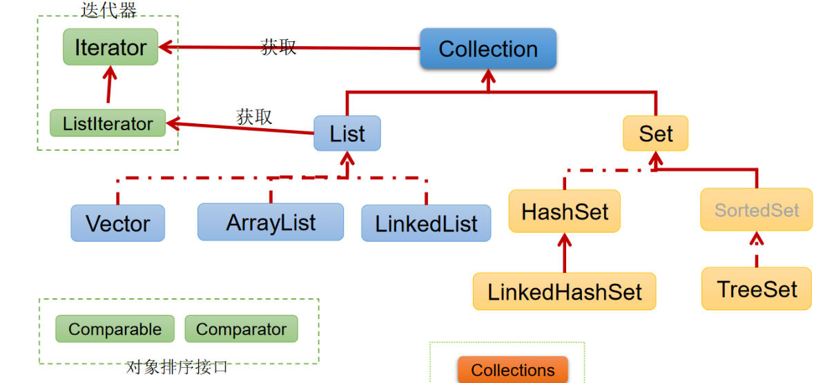

2.map接口继承树

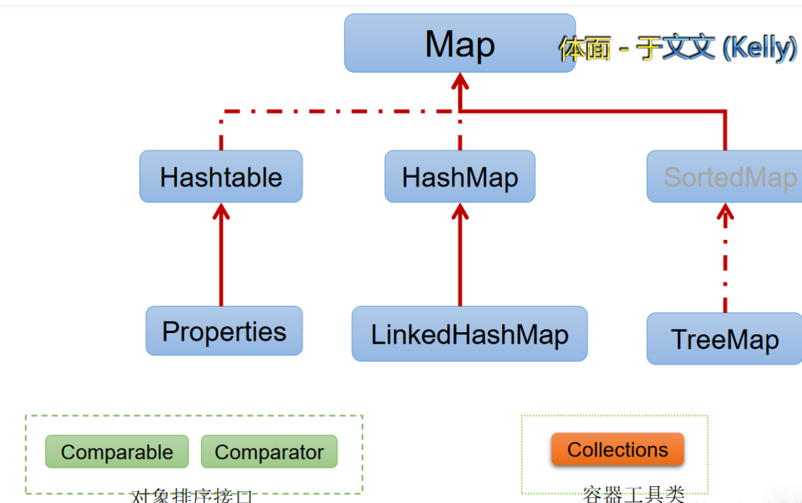

### Collection 接口方法
Collection 接口是List、Set 和Queue 接口的父接口，该接口里定义的方法既可用于操作Set 集合，也可用于操作List 和Queue 集合。
JDK不提供此接口的任何直接实现，而是提供更具体的子接口(如：Set和List)实现。
在Java5 之前，Java 集合会丢失容器中所有对象的数据类型，把所有对象都当成Object 类型处理；从JDK 5.0 增加了泛型以后，Java 集合可以记住容器中对象的数据类型。
##### [<font color=red>Collection接口中的常用方法1</font>](Collectionpractice5/CollectinoTest.java)
##### [<font color=red>Collection接口中的常用方法2</font>](Collectionpractice5/CollectinoTest1.java)
##### [<font color=red>Collection接口中的常用方法3</font>](Collectionpractice5/CollectionTest2.java)
##### [<font color=red>Collection接口中的常用方法4</font>](Collectionpractice5/CollectinoTest3.java)

### Iterator迭代器接口
  * Collection接口继承了java.lang.Iterable接口，该接口有一个iterator()方法，
  那么所有实现了Collection接口的集合类都有一个iterator()方法，用以返回一个实
  现了Iterator接口的对象。
  * 用于遍历Collection集合中元素
  * 集合对象每次调用iterator()方法都得到一个全新的迭代器对象，默认游标都在集
  合的第一个元素之前。


##### [<font color=red>使用Iterator遍历Collection</font>](Collectionpractice5/IteratorTest.java)

* Iterator遍历集合的两种错误写法
  ```java
  import org.junit.Test;

  import java.util.ArrayList;
  import java.util.Collection;
  import java.util.Iterator;

  /**
  * 集合元素的遍历操作，使用迭代器Iterator接口
  * 1.内部的方法：hasNext()和 next()
  * 2.集合对象每次调用iterator()方法都得到一个全新的迭代器对象，默认游标都在集合的第一个元素之前。
  */
  public class IteratorTest {

      @Test
      public void test2(){
          Collection coll = new ArrayList();
          coll.add(123);
          coll.add(456);
          coll.add(new Person("Jerry",20));
          coll.add(new String("Tom"));
          coll.add(false);

          //错误方式一：
  //        Iterator iterator = coll.iterator();
  //        while(iterator.next() != null){
  //            System.out.println(iterator.next());
  //        }

          //错误方式二：
          //集合对象每次调用iterator()方法都得到一个全新的迭代器对象，默认游标都在集合的第一个元素之前。
          while(coll.iterator().hasNext()){
              System.out.println(coll.iterator().next());
          }
      }
  }
  ``` 

##### [<font color=red>Iterator迭代器remove()的使用</font>](Collectionpractice5/CollectinoTest1.java)

##### java新特性foreach循环遍历集合或数组
* Java 5.0 提供了foreach循环迭代访问Collection和数组。
* 遍历操作不需获取Collection或数组的长度，无需使用索引访问元素。
* 遍历集合的底层调用Iterator完成操作。
* foreach还可以用来遍历数组。
  ```java
  import org.junit.Test;

  import java.util.ArrayList;
  import java.util.Collection;

  /**
  * jdk 5.0 新增了foreach循环，用于遍历集合、数组
  *
  */
  public class ForTest {

      @Test
      public void test(){
          Collection coll = new ArrayList();
          coll.add(123);
          coll.add(456);
          coll.add(new Person("Jerry",20));
          coll.add(new String("Tom"));
          coll.add(false);

          //for(集合元素的类型 局部变量 : 集合对象),内部仍然调用了迭代器。
          for(Object obj : coll){
              System.out.println(obj);
          }
      }

      @Test
      public void test2(){
          int[] arr = new int[]{1,2,3,4,5,6};
          //for(数组元素的类型 局部变量 : 数组对象)
          for(int i : arr){
              System.out.println(i);
          }
      }

      //练习题
      @Test
      public void test3(){
          String[] arr = new String[]{"SS","KK","RR"};

  //        //方式一：普通for赋值
  //        for(int i = 0;i < arr.length;i++){
  //            arr[i] = "HH";
  //        }

          //方式二：增强for循环
          for(String s : arr){
              s = "HH";
          }

          for(int i = 0;i < arr.length;i++){
              System.out.println(arr[i]);
          }
      }
  }
  ``` 
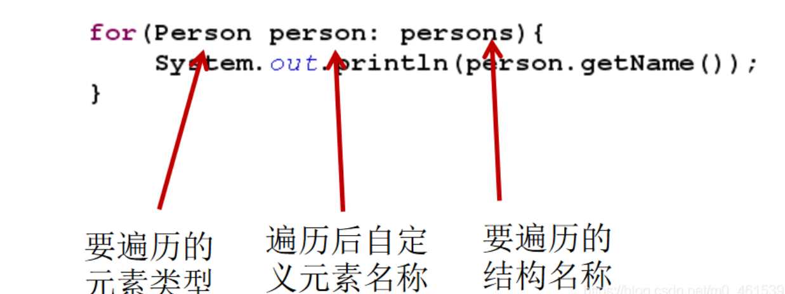

### Collection子接口之一：List接口
* 通常用list替代数组
* List集合类中元素有序、且可重复，集合中的每个元素都有其对应的顺序索引。
* List容器中的元素都对应一个整数型的序号记载其在容器中的位置，可以根据序号存取容器中的元素
* DK API中List接口的实现类常用的有：ArrayList、LinkedList和Vector。

##### List接口常用实现类的对比
* 区别
  ```java
  /**
   * 1. List接口框架
  *
  *    |----Collection接口：单列集合，用来存储一个一个的对象
  *          |----List接口：存储有序的、可重复的数据。  -->“动态”数组,替换原有的数组
  *              |----ArrayList：作为List接口的主要实现类；线程不安全的，效率高；底层使用Object[] elementData存储
  *              |----LinkedList：对于频繁的插入、删除操作，使用此类效率比ArrayList高；底层使用双向链表存储
  *              |----Vector：作为List接口的古老实现类；线程安全的，效率低；底层使用Object[] elementData存储
  *
  *
  * 面试题：比较ArrayList、LinkedList、Vector三者的异同？
  *        同：三个类都是实现了List接口，存储数据的特点相同：存储有序的、可重复的数据
  *        不同：见上
  *
  */
  ```
##### [<font color=red >ArrayList的源码分析</font>](Collectionpractice5/ArrayList.md)
##### LikedList源码分析
```java
/**
  * 3.LinkedList的源码分析：
  *       LinkedList list = new LinkedList(); 内部声明了Node类型的first和last属性，默认值为null
  *       list.add(123);//将123封装到Node中，创建了Node对象。
  *
  *       其中，Node定义为：体现了LinkedList的双向链表的说法
  *       private static class Node<E> {
  *            E item;
  *            Node<E> next;
  *            Node<E> prev;
  *
  *            Node(Node<E> prev, E element, Node<E> next) {
  *            this.item = element;
  *            this.next = next;     //next变量记录下一个元素的位置
  *            this.prev = prev;     //prev变量记录前一个元素的位置
  *            }
  *        }
  */
```


##### List接口中的常用方法测试
> List除了从Collection集合继承的方法外，List 集合里添加了一些根据索引来操作集合元素的方法
  * $\color{cyan}{void add(intindex, Object ele)}$:在index位置插入ele元素
  * $\color{cyan}{boolean addAll(int index, Collection eles)}$:从index位置开始将eles中的所有元素添加进来
  * $\color{cyan}{Object get(int index)}$:获取指定index位置的元素
  * $\color{cyan}{int indexOf(Object obj)}$:返回obj在集合中首次出现的位置
  * $\color{cyan}{int lastIndexOf(Object obj)}$:返回obj在当前集合中末次出现的位置
  * $\color{cyan}{Object remove(int index)}$:移除指定index位置的元素，并返回此元素
  * $\color{cyan}{Object set(int index, Object ele)}$:设置指定index位置的元素为ele
  * $\color{cyan}{List subList(int fromIndex, int toIndex)}$:返回从fromIndex到toIndex位置的子集合
    ```java
    import org.junit.Test;
    import java.util.ArrayList;
    import java.util.Arrays;
    import java.util.Iterator;
    import java.util.List;

    /**
    *
    * 5.List接口的常用方法
    */
    public class ListTest {
        /**
        *
        * 总结：常用方法
        * 增：add(Object obj)
        * 删：remove(int index) / remove(Object obj)
        * 改：set(int index, Object ele)
        * 查：get(int index)
        * 插：add(int index, Object ele)
        * 长度：size()
        * 遍历：① Iterator迭代器方式
        *      ② 增强for循环
        *      ③ 普通的循环
        *
        */

        @Test
        public void test3(){
            ArrayList list = new ArrayList();
            list.add(123);
            list.add(456);
            list.add("AA");

            //方式一：Iterator迭代器方式
            Iterator iterator = list.iterator();
            while(iterator.hasNext()){
                System.out.println(iterator.next());
            }

            System.out.println("***************");

            //方式二：增强for循环
            for(Object obj : list){
                System.out.println(obj);
            }

            System.out.println("***************");

            //方式三：普通for循环
            for(int i = 0;i < list.size();i++){
                System.out.println(list.get(i));
            }
        }

        @Test
        public void tets2(){
            ArrayList list = new ArrayList();
            list.add(123);
            list.add(456);
            list.add("AA");
            list.add(new Person("Tom",12));
            list.add(456);
            //int indexOf(Object obj):返回obj在集合中首次出现的位置。如果不存在，返回-1.
            int index = list.indexOf(4567);
            System.out.println(index);

            //int lastIndexOf(Object obj):返回obj在当前集合中末次出现的位置。如果不存在，返回-1.
            System.out.println(list.lastIndexOf(456));

            //Object remove(int index):移除指定index位置的元素，并返回此元素
            Object obj = list.remove(0);
            System.out.println(obj);
            System.out.println(list);

            //Object set(int index, Object ele):设置指定index位置的元素为ele
            list.set(1,"CC");
            System.out.println(list);

            //List subList(int fromIndex, int toIndex):返回从fromIndex到toIndex位置的左闭右开区间的子集合
            List subList = list.subList(2, 4);
            System.out.println(subList);
            System.out.println(list);
        }

        @Test
        public void test(){
            ArrayList list = new ArrayList();
            list.add(123);
            list.add(456);
            list.add("AA");
            list.add(new Person("Tom",12));
            list.add(456);

            System.out.println(list);

            //void add(int index, Object ele):在index位置插入ele元素
            list.add(1,"BB");
            System.out.println(list);

            //boolean addAll(int index, Collection eles):从index位置开始将eles中的所有元素添加进来
            List list1 = Arrays.asList(1, 2, 3);
            list.addAll(list1);
    //        list.add(list1);
            System.out.println(list.size());//9

            //Object get(int index):获取指定index位置的元素
            System.out.println(list.get(2));

        }
    }
    ```

### Collection子接口之二：Set接口
* Set接口是Collection的子接口，set接口没有提供额外的方法
* Set 集合不允许包含相同的元素，如果试把两个相同的元素加入同一个Set 集合中，则添加操作失败。
* Set 判断两个对象是否相同不是使用==运算符，而是根据equals()方法
##### Set接口实现类的对比
* Set接口的框架：
  |----Collection接口：单列集合，用来存储一个一个的对象
           |----Set接口：存储无序的、不可重复的数据   -->高中讲的“集合”
              |----HashSet：作为Set接口的主要实现类；线程不安全的；可以存储null值
                  |----LinkedHashSet：作为HashSet的子类；遍历其内部数据时，可以按照添加的顺序遍历
                                     对于频繁的遍历操作，LinkedHashSet效率高于HashSet.
              |----TreeSet：可以按照添加对象的指定属性，进行排序。

##### Set的无序性与不可重复性的理解
* 无序性：不等于随机性。存储的数据在底层数组中并非按照数组索引的顺序添加，而是根据数据的哈希值决定的。
* 不可重复性：保证添加的元素按照equals()判断时，不能返回true.即：相同的元素只能添加一个。

##### HashSet中元素的添加过程
* HashSet是Set 接口的典型实现，大多数时候使用Set 集合时都使用这个实现类。
* HashSet按Hash 算法来存储集合中的元素，因此具有很好的存取、查找、删除性能。
* HashSet具有以下特点：不能保证元素的排列顺序


# 泛型
##### 为什么要有泛型
> 泛型：标签
> 举例：中药店，每个抽屉外面贴着标签
超市购物架上很多瓶子，每个瓶子装的是什么，有标签
##### 泛型的设计背景
> 集合容器类在设计阶段/声明阶段不能确定这个容器到底实际存的是什么类型的对象，所以在JDK1.5之前只能把元素类型设计为Object，
JDK1.5之后使用泛型来解决。因为这个时候除了元素的类型不
确定，其他的部分是确定的，例如关于这个元素如何保存，如
何管理等是确定的，因此此时把元素的类型设计成一个参数，
这个类型参数叫做泛型。Collection，List，ArrayList这
个就是类型参数，即泛型。


# File类的使用


线程看到14-同步机制的课后练习
常用类看到10-SimpleDateFor
注解新特性


